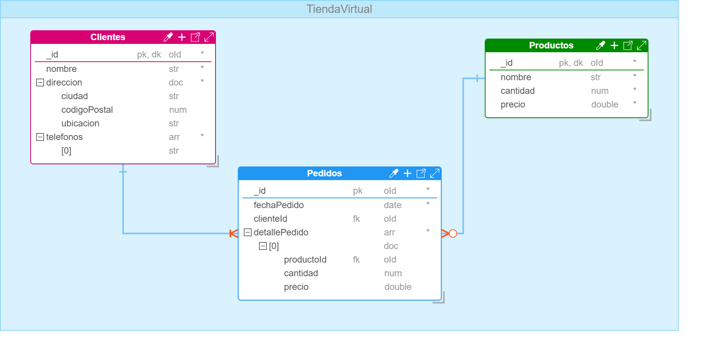

# Modelado de Bases de Datos Documentales

El modelado de datos permite la abstracción y representación visual de los requerimientos de una base de datos, mediante un conjunto de reglas y símbolos asociados a un lenguaje de modelado ​[[1]](../05-Referencias/05-Referencias-Modulo-1.md#1)​. Estos modelos permiten organizar los datos y visualizar las diferentes relaciones entre los elementos identificados. Cabe resaltar, que en el contexto de las bases de datos NoSQL y en especial las bases de documentos en MongoDB siguen un esquema de modelos flexible ​[[2]](../05-Referencias/05-Referencias-Modulo-1.md#2)​. Esto significa que las bases de datos pueden adaptarse rápidamente a los cambios en los datos, respondiendo tanto a las demandas del dominio del problema y las necesidades del negocio, como a los desafíos del equipo de desarrollo en la construcción de aplicaciones software. Este tipo de bases de datos facilitan la integración de cambios, escalabilidad horizontal, un manejo eficiente de grandes volúmenes de datos y son compatibles con arquitecturas de software modernas.

A nivel de MongoDB se pueden diseñar modelos de datos que hacen uso de estructuras de datos embebidos o referenciados ​[[3]](../05-Referencias/05-Referencias-Modulo-1.md#3)​. En el caso de los datos embebidos hace referencia a documentos dentro de documentos. Mientras que los datos relacionados representan relaciones a colecciones de la base de datos. En la Figura 1, se puede observar un ejemplo básico del modelado de datos de una base de datos documental para MongoDB realizado en [Hackolade](https://studio.hackolade.com/) (Es una herramienta de modelado de datos SQL y NoSQL que permite diseñar, visualizar y documentar bases de datos, además de generar scripts para su implementación según el sistema de gestión de bases de datos seleccionado).

[Ver_Script](../../scripts/Tienda-Virtual.md)

**Figura 1: Modelado de Datos de Documentos MongoDB en Hackolade**

Ahora, es importante comprender qué son los documentos, colecciones y esquemas, ya que son elementos principales de una base de datos en MongoDB.
