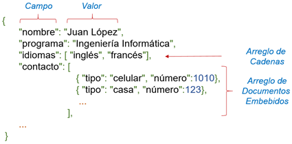

# Documentos

  Los documentos son el elemento principal de esta base de datos, ya que permiten el almacenamiento de datos de forma estructurada y no estructurada. Estos se asemejan a los registros de las tablas de una base de datos relacional. Los documentos son estructuras de datos ordenadas conformadas por claves y valores asociados los cuales se asemejan a un registro o fila de una tabla de una base de datos relacional ​[[4]](../05-Referencias/05-Referencias.md#4), ​[[5]](../05-Referencias/05-Referencias.md#5). Estos documentos se definen en el formato BSON (JSON Binario), empleado por MongoDB para organizar y almacenar datos ​[[6]](../05-Referencias/05-Referencias.md#6).

 _Un ejemplo de cómo se estructura un documento en MongoDB se puede observar a continuación:_
 ```
{
   campo_1: valor_1,
   campo_2: valor_2,
   ...............................
   campo_n: valor_n
}
 ```
Cabe resaltar que las claves representan los campos de un documento y los valores son los datos asociados a cada una de las claves. 
Los valores pueden ser de diferentes tipos de datos, como caracteres, números, arreglos, otros documentos embebidos, etc. 

                                                    
##### Figura 2. Documento

_Codigo_
 ```
{
  "nombre": "Juan López",
  "programa": "Ingeniería Informática",
  "idiomas": ["inglés", "francés"],
  "contacto": [
    { "tipo": "celular", "número": 1010 },
    { "tipo": "casa", "número": 123 }
  ]
}
}
 ```
En la Figura 2, se observa un ejemplo de un documento en MongoDB, compuesto por campos que almacena valores de diferentes tipos de datos. Los campos nombre, programa e idiomas son campos de valores simple. Los dos primeros que contienen cadenas mientras que el ultimo contiene un arreglo de cadenas.
Por otro lado, el campo contacto es un arreglo de documentos embebidos.
