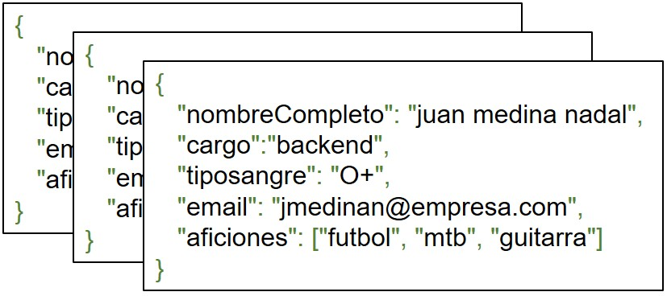
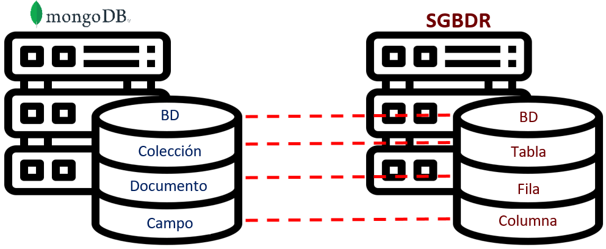

# Colecciones

Las colecciones son contenedores de documentos. Una colección se asemeja a las tablas de una base de datos relacional ​[[4]](../05-Referencias/05-Referencias-Modulo-1.md#4), [[5]](../05-Referencias/05-Referencias-Modulo-1.md#5), [[7]](../05-Referencias/05-Referencias-Modulo-1.md#7)​, entonces su existencia depende de la existencia de una base de datos.

**Figura 3. Colección**

En la Figura 4, se compara con elementos de una base de datos de documentos en MongoDB y una base de datos relacional.

**Figura 4. Comparación entre MongoDB y los SGBDR²**

### Notas al pie

- [²] Sistema de Gestión de Bases de Datos Relacionales (por ejemplo, MySQL, PostgreSQL, Oracle, etc)

## Continúa con [Esquema 🧩➡️](2.4-Esquema.md)
