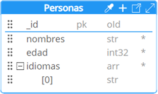
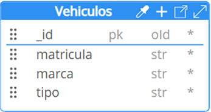

# Esquema

Un esquema en MongoDB es un objeto JSON que permite definir la estructura de los documentos dentro de una colección. En los esquemas, se pueden especificar los tipos de datos que tomarán cada uno de los campos de un documento, incluyendo tipos primitivos como cadenas y números, así como tipos estructurales como objetos y arreglos ​[[8]](../05-Referencias/05-Referencias.md#8)​. Además, los esquemas permiten establecer niveles de validación y control para evitar errores durante la inserción de datos. Los niveles de validación y control se pueden categorizar en: Flexible, semi flexible (Moderado) y no flexible (Estricto).

## Flexible

En MongoDB, los documentos dentro de una colección pueden tener estructuras diferentes sin restricciones sobre los campos. Esto significa que no es obligatorio definir un esquema de validación, ya que MongoDB permite esta flexibilidad de forma predeterminada. En el siguiente ejemplo, se presentan dos documentos de la misma colección, donde el único campo en común es el identificador **`_id`**.

_Ejemplo de documentos:_

```
{
    _id: ObjectId("64f7ea6cffa6e715ea6ac2ea"),
    nombres: 'camila perez',
    edad: 21,
    idiomas: ['ingles', 'frances', 'aleman' ]
},

{
    _id: ObjectId("64f7ea6cffa6e715ea6ac2eb"),
    nombreCompleto: 'sandra suarez',
    genero: 'femenino'
}
```

Como se observa, ambos documentos tienen diferentes estructuras: el primero incluye campos como **`_nombres`**, **`edad`** e **`idiomas_`**, mientras que el segundo solo tiene **`nombreCompleto`** y **`genero`**. Esta flexibilidad es una de las ventajas de MongoDB, ya que permite almacenar datos heterogéneos dentro de una misma colección.

## Semi Flexible (Moderado)

Este tipo de esquema permite establecer ciertas reglas de validación a una colección haciendo uso de JSON Schema. A través de la definición de campos comunes que la mayoría de los documentos de una colección deben cumplir. Esto proporciona un equilibrio entre la flexibilidad de los documentos y el control sobre los datos almacenados, garantizando que ciertos campos se mantengan consistentes sin restringir totalmente la estructura.

_Ejemplo de una Colección:_



Para implementar la validación de la colección “Personas”, podemos crear el siguiente JSON Schema:

```
db.createCollection("Personas", {
    "capped": false,
    "validator": {
        "$jsonSchema": {
            "bsonType": "object",
            "title": "Personas",
            "properties": {
                "_id": {

                    "bsonType": "objectId"
                },
                "nombres": {

                    "bsonType": "string"
                },
                "edad": {

                    "bsonType": "int"
                },
                "idiomas": {
                    "bsonType": "array",
                    "additionalItems": true,
                    "items": {
                        "bsonType": "string"
                    }
                }
            },
            "additionalProperties": true,
            "required": [
                "_id",
                "nombres",
                "edad",
                "idiomas"
            ]
        }
    },
    "validationLevel": "moderate",
    "validationAction": "error"
});
```

**Explicación:** Este JSON Schema establece que cada documento en la colección “Personas” debe incluir los campos **`_id`**, **`nombres`**, **`edad`** e **`idiomas`**, con los tipos de datos _(bsonType3)_ especificados. La propiedad **`"additionalProperties": true`**, permite que los documentos contengan otros campos adicionales. Al configurar **`"validationLevel": "moderate"`** y **`"validationAction": "error"`**, MongoDB aplicará una validación moderada (es decir, define el tipo de esquema aplicado a la colección) y mostrará un error si un documento no cumple con los campos obligatorios. Finalmente, la propiedad **`"capped"`**: indica que la colección no tiene un límite máximo de documentos que puede almacenar.

_Ejemplo de documentos:_

```
[
  {
    _id: ObjectId("64f7ea6cffa6e715ea6ac2ea"),
    nombres: ‘camila perez',
    edad: 21,
    idiomas: ['ingles', 'frances', 'aleman' ]
  },
  {
    _id: ObjectId("64f7ea6cffa6e715ea6ac2eb"),
    nombres: ‘sandra suarez',
    edad: 19,
    idiomas: [ 'ingles ', 'frances' ],
    intereses: [ ‘lectura', 'viajes' ]
  }
]
```

En este ejemplo, ambos documentos de la colección incluyen los campos comunes **`nombres`**, **`edad`** e **`idiomas`**, siguiendo las reglas básicas establecidas. Sin embargo, también tienen la flexibilidad de contener otros campos, como **`intereses`**, lo que permite una estructura variada en los datos sin perder consistencia en los elementos esenciales.

## No Flexible (Estricto)

Este nivel de validación permite establecer reglas rigurosas mediante JSON Schema que todos los documentos de una colección deben cumplir sin excepciones. Este esquema establece restricciones similares a las de los esquemas de bases de datos relacionales, asegurando que todos los documentos mantengan una estructura uniforme.



**Figura 6. Colección Vehiculos**

Para implementar la validación de la colección “Vehiculos”, podemos crear el siguiente JSON Schema:

```
db.createCollection("Vehiculos", {
    "capped": false,
    "validator": {
        "$jsonSchema": {
            "bsonType": "object",
            "title": "Vehiculos",
            "properties": {
                "_id": {
                    "bsonType": "objectId"
                },
                "matricula": {
                    "bsonType": "string"
                },
                "marca": {
                    "bsonType": "string"
                },
                "tipo": {
                    "bsonType": "string",
                    "enum": [
                        "automóvil",
                        "moto",
                        "cuatrimoto",
                        "bicicleta"
                    ]
                }
            },
            "additionalProperties": false,
            "required": [
                "_id",
                "matricula",
                "marca",
                "tipo"
            ]
        }
    },
    "validationLevel": "strict",
    "validationAction": "error"
});
```

**Explicación:** Este JSON Schema establece que cada documento de la colección “Vehiculos” debe incluir los campos **`_id`**, **`matricula`**, **`marca`** y **`tipo`**, todos con tipos de datos específicos definidos por **`bsonType`**. Además, el campo **`tipo`** solo puede tener uno de los valores predefinidos en el **`ENUM`**: **`"automóvil"`**, **`"moto"`**, **`"cuatrimoto"`** o **`"bicicleta"`**. La propiedad **`"additionalProperties": false`**, garantiza que no se puedan agregar campos adicionales, lo que limita la estructura de los documentos a los campos especificados. Al usar **`"validationLevel": "strict"`** y **`"validationAction": "error"`**, MongoDB rechazará cualquier documento que no cumpla completamente con este esquema, aplicando así una validación estricta.

_Ejemplo de documentos:_

- Documento Válido:

```
{
    _id: ObjectId("64f7ea6cffa6e715ea6ac2eb"),
    matricula: 'HPQ 087',
    marca: 'FORD',
    tipo: 'automóvil'
}
```

Este documento cumple con el esquema definido en _Vehiculos_, ya que incluye los campos obligatorios **`_id`**, **`matricula`**, **`marca`** y **`tipo`**, y respeta los tipos de datos y las restricciones especificadas _(como el valor permitido para tipo)_.

- Documento inválido

```
{
    _id: ObjectId("64f7ea6cffa6e715ea6ac2ef"),
    matricula: 'HPQ 087',
    marca: 'FORD',
    modelo: ' Escape Híbrida',
    tipo: 'automóvil'
}
```

Aunque el documento incluye los campos obligatorios (**`_id`**, **`matricula`**, **`marca`** y **`tipo`**) con los tipos y valores correctos, contiene un campo extra (**`modelo`**). Dado que en el esquema se estableció la propiedad **`"additionalProperties": false`**, cualquier campo no definido en el esquema hará que el documento sea rechazado.
