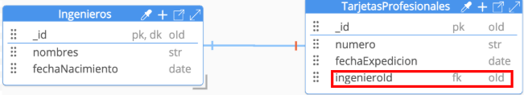
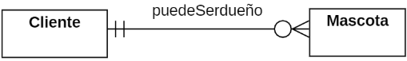
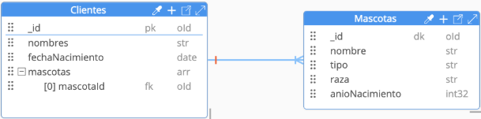
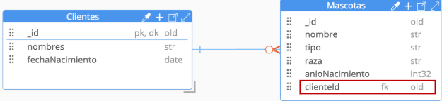
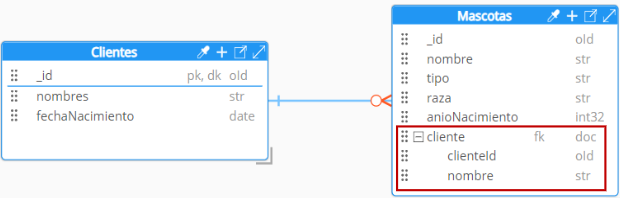
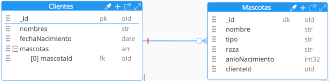
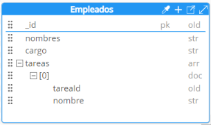
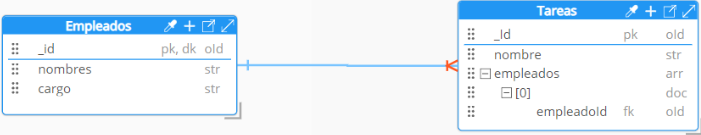
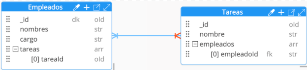

# Tipos de Relaciones

## _**Relación uno-a-uno**_

Es la asociación de dos documentos presentes en diferentes colecciones (A y B). En donde un documento de la colección A se puede relacionar solo con un documento de la colección B y viceversa.

_**Ejemplo:** Un Ingeniero tiene una tarjeta profesional._

**Figura 7. Relación uno-a-uno**

## **Solución 1:** Mediante documentos embebidos [[10]](../05-Referencias/05-Referencias-Modulo-1.md#10)

**Figura 8. Solución 1 Relación uno-a-uno**

**Explicación:** Identificar la colección “padre” y crear un documento embebido que represente la colección “hija”. Es importante aclarar que en el contexto de MongoDB la selección de la colección “padre” e “hija” dependerá del contexto y las necesidades de la aplicación. Esta opción es óptima cuando los datos relacionados de la colección “hija” son pequeños y se acceden con el documento principal. En la Figura 8, se puede observar que TarjetaProfesional se convirtió en una propiedad en la colección Ingenieros, nombrada como tarjetaProfesional. Esta propiedad es un documento embebido el cual está constituido por el número, fecha de expedición, universidad y entidad.

## **Solución 2:** Mediante documento relacionados [[10]](../05-Referencias/05-Referencias-Modulo-1.md#10)

**Figura 9. Solución 2 Relación uno-a-uno**

**Explicación:** Identificar la colección “padre” y en la colección “hija” se creará un campo de referencia a un documento a la colección “padre”. Es importante señalar que también se podría implementar solo guardando la referencia de la colección “hija” en el padre. Esta opción es útil cuando los datos relacionados de la colección “hija” son grandes o se acceden de forma independiente.

## _**Relación uno-a-muchos**_

Es la asociación en donde un documento de la colección A se puede relacionar con varios documentos de la colección B, pero un documento de la colección B solo puede estar relacionado con uno documento de la colección A.

_**Ejemplo:** Un cliente puede ser dueño de muchas mascotas._

**Figura 10. Relación uno-a-muchos**

## **Solución 1:** Mediante documentos embebidos [[11]](../05-Referencias/05-Referencias-Modulo-1.md#11)

**Figura 11. Solución 2 Relación uno-a-uno**

**Explicación:** Identificar la colección “padre” y crear un array de documentos que representen la colección “hija”. Esta opción es recomendada si la colección “hija” no puede existir por si sola y se accede con el documento principal. Podría ser ineficiente si el arreglo no tiene límites. En la Figura 10, se puede observar Mascotas se convirtió en una propiedad en la colección Clientes, a través de la especificación de un arreglo que contendrá documentos embebidos de la información de las diferentes mascotas.

## **Solución 2:** Mediante documentos relacionados (Forma 1) [[11]](../05-Referencias/05-Referencias-Modulo-1.md#11)

**Figura 12. Solución 2 Relación uno-a-muchos (Forma 1)**

**Explicación:** Identificar la colección “padre” y crear un arreglo referencias a la colección “hija”. Esta es una opción recomendada si la colección “hija” puede llegar a tener documentos ilimitados. En la Figura 11, se puede observar que en la colección Clientes se creó un arreglo denominado o nombrado mascotasId que permitirá almacenar las diferentes relaciones a la colección Mascotas.

## **Solución 2:** Mediante documentos relacionados (Forma 2) ​[[11]](../05-Referencias/05-Referencias-Modulo-1.md#11)

**Figura 13. Solución 2 Relación uno-a-muchos (Forma 2)**

**Explicación:** Identificar la colección “padre” y crear una referencia de este en la colección “hija”. Esta referencia puede ser únicamente con identificador de la colección padre. También se puede crear un documento con campos adicionales al identificar para facilitar las consultas.

## **Solución 2:** Mediante documentos relacionados (Forma 3) ​[[11]](../05-Referencias/05-Referencias-Modulo-1.md#11)

  
**Figura 14. Solución 2 Relación uno-a-muchos (Forma 3)**

**Explicación:** Identificar la colección “padre” y crear una referencia de este en la colección “hija”. Esta referencia puede ser únicamente con identificador de la colección padre o se puede crear un documento con campos adicionales para facilitar las consultas. En la Figura 13, se puede observar que en la colección Mascotas se creó la propiedad cliente que es un documento embebido de referencia el cual está constituido por clienteId y nombre.

## **Solución 2:** Mediante documentos relacionados (Forma 4) ​[[11]](../05-Referencias/05-Referencias-Modulo-1.md#11)

**Figura 15. Solución 2 Relación uno-a-muchos (Forma 4)**

**Explicación:** Mediante referencias bidireccionales. En este caso la colección “padre” tendrá un arreglo de referencia a los documentos de la colección “hija”. Y en la colección “hija” tendrá una referencia a un documento de la colección “padre”. Sin embargo, este enfoque no es óptimo debido a la complejidad que genera en las consultas y en el mantenimiento de la consistencia de los datos. Cada vez que se realiza un cambio en una de las colecciones, se requieren múltiples consultas para mantener sincronizadas las referencias, lo que puede incrementar el tiempo de ejecución y el costo computacional, afectando el rendimiento de la aplicación.

## _**Relación muchos-a-muchos**_

Es la asociación en donde un documento de una colección A, se puede relacionar con uno o muchos documentos de la colección B y viceversa.

_**Ejemplo:** Un empleado realiza muchas tareas y una tarea es realizada por muchos empleados_

**Figura 16. Relación muchos-a-muchos**

## **Solución 1:** Mediante documentos embebidos [[12]](../05-Referencias/05-Referencias-Modulo-1.md#12)

**Figura 17. Solución 1 Relación muchos-a-muchos**

**Explicación:** Identificar la colección “padre” y crear un array de documentos embebidos. Cada elemento del array representa un documento de la colección “hija”. Mediante esta solución no se crea la colección “hija” de forma independiente. Una de las posibles falencias es la duplicidad de datos. En la Figura 16, es posible observar que en la Colección Empleados se creó la propiedad tareas que es un arreglo de documentos embebidos de información de tareas.

## **Solución 2:** Mediante documentos relacionados (Forma 1) [[12]](../05-Referencias/05-Referencias-Modulo-1.md#12)

_**Nota:** La relación también se puede hacer en la dirección opuesta._

**Figura 18. Solución 2 Relación muchos-a-muchos (Forma 1)**

**Explicación:** Identificar la colección "padre" y crear un arreglo referencias a la colección “hija”. Esta es una de las opciones preferidas de implementación. En la Figura 17, se puede observar que en la colección Tareas se creó la propiedad empleados que es un arreglo de referencias a la colección Empleados.

## **Solución 2:** Mediante documentos relacionados (Forma 2) [[12]](../05-Referencias/05-Referencias-Modulo-1.md#12)

**Figura 19. Solución 2 Relación muchos-a-muchos (Forma 2)**

**Explicación:** Guardar referencias de forma bidireccional en ambas colecciones. Es uno de los enfoques menos recomendados ya que son más caras de gestionar en términos de rendimiento, consistencia de datos y complejidad en las operaciones. Al emplear este enfoque se tendrían dificultades similares a las señaladas en una relación uno a muchos (complejidad de consultas, mantenimiento de consistencia de datos y rendimiento). En la Figura 18 es posible observa que en cada una de las colecciones se creó el arreglo de referencias.

## Continúa con el siguiente tema: [Herramienta de Modelado de Datos 🛠️➡️](/docs/04-Herramienta-de-Modelado/4.1-Herramienta-de-modelado-de-datos.md)
