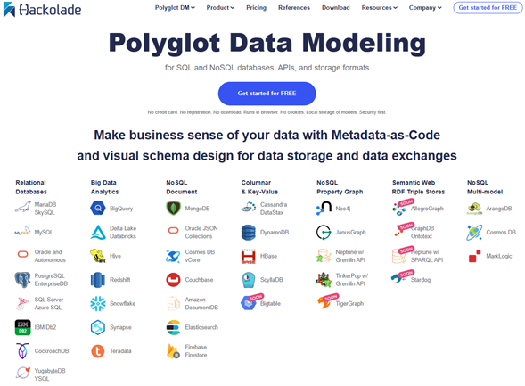
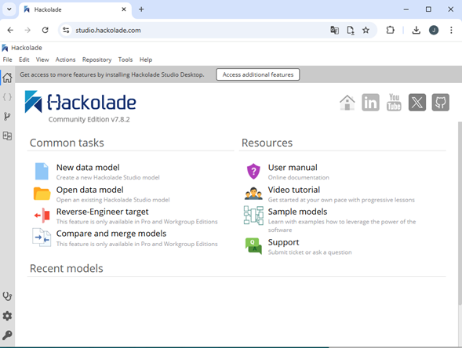

# Herramienta de Modelado de Datos

Las herramientas de modelado de datos permiten a los diseñadores de bases de datos modelar y visualizar bases de bases de datos SQL y NoSQL, al permitir la creación de esquemas y relaciones entre los diferentes elementos modelados. Este tipo de herramientas son esenciales para asegurar que las estructuras de datos sean precisas, eficientes y alineadas con los requisitos de una aplicación informática.

Hackolade es una herramienta de modelado poliglota que permite diseñar bases de datos SQL y NoSQL a través de una interfaz intuitiva. Facilita la creación de esquemas completos de datos y la generación de scripts para su implementación en cualquiera de los sistemas de gestión de bases de datos seleccionados.

Para realizar el modelado de una base de datos se deberá dar click en el botón [“Get started for FREE”](https://studio.hackolade.com/) en el sitio principal de Hackolade (ver Figura 19). Una vez realizado este paso se dará apertura a la página de bienvenida en donde podremos crear un nuevo modelo de datos, abrir y visualizar los modelos de recientes, y acceder a recursos de ayuda.

**Figura 19. Hackolade**

**Figura 20. Página de Bienvenida de Hackolade**
