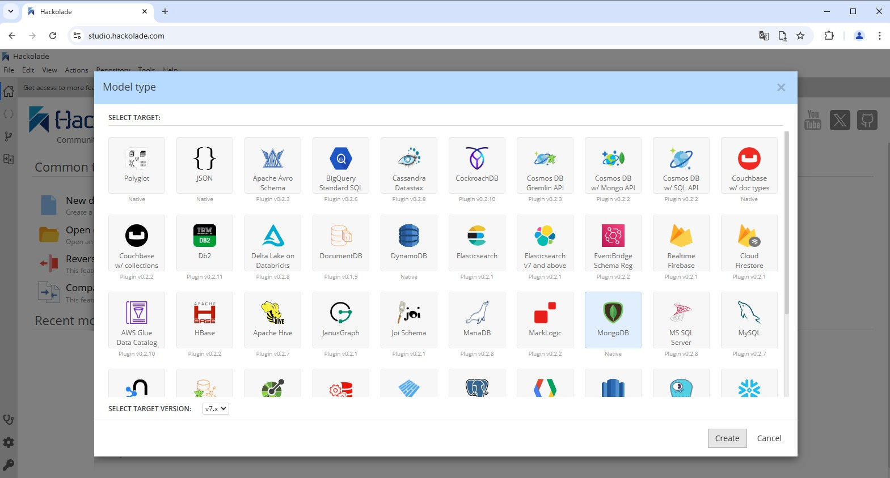
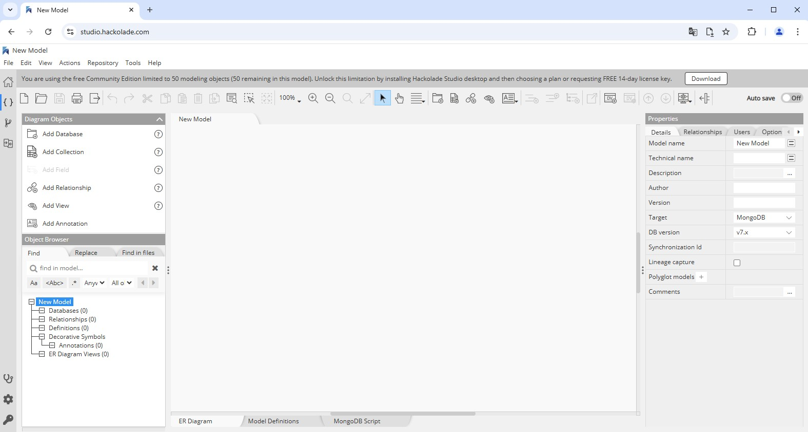

# Crear un Modelo de Datos

Para crear un nuevo modelo de datos daremos clic en el icono de “New data model” de la página de bienvenida o mediante el menú File, seleccionamos la base de datos MongoDB y damos clic en el botón “Create”.

**Figura 21. Crear un Modelo de Datos**

Una vez realizada esta acción nos deberá aparecer el área de trabajo de Hackolade para modelar una base de datos de MongoDB, en donde podremos encontrar de manera general:

- El panel de navegador de objetos el cual hace referencia a los diferentes componentes (base de datos, colecciones).

- El panel central que es donde se realizará el modelado de las diferentes colecciones y sus relaciones.

- Panel de propiedades en donde se podrá especificar las características principales de cada uno de los componentes de una base de datos, colecciones, propiedades y relaciones.

- Y la Pestaña de MongoDB Script en donde podremos generar el esquema de toda la base de datos.

**Figura 22. Área de Trabajo de Hackolade**
