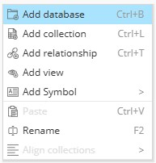

# Modelar una Base de Datos

Para modelar una base de datos podemos dar clic en el botón de _“Add Database”_ del área de Objetos de Diagramas del panel de navegador de objetos o clic derecho en el panel central en donde aparecerá una ventana emergente _(ver Figura 23)_ y seleccionamos _“Add Database”_.

**Figura 23. Add Database**

Ahora especificaremos el nombre de la base de datos. Por tanto, seleccionamos en el panel central el ícono de la base de datos y en el panel de propiedades brindaremos el nombre de la base de datos.
