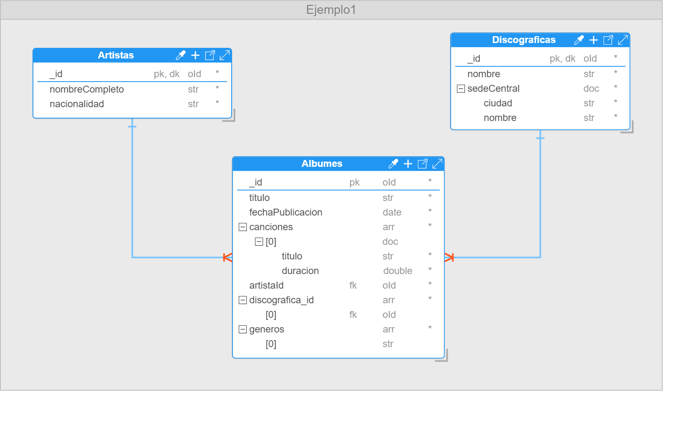

# Ejemplo 1: Aplicación Gestión de Música Online

Se desea crear una base de datos que permita gestionar información relevante sobre artistas, discográficas y álbumes musicales. Para los artistas, se debe almacenar una identificación única, nombre completo y nacionalidad. En el caso de las discográficas, se requiere registrar un identificador único, nombre, y sede central (que incluye ciudad y país).

Para cada álbum, es necesario gestionar los siguientes datos: título, fecha de publicación, lista de canciones (cada una con su título y duración) y géneros musicales. Cada álbum incluirá referencias al artista que lo creó, mediante el campo **`artista_id`**, **`nombre`**, y a la(s) discográfica(s) que lo produjo, a través de **`discografica_id`**. En algunos casos, un álbum puede estar asociado con múltiples discográficas.

Los géneros musicales admitidos actualmente en la base de datos son: pop, urbano, rock y balada.

Finalmente, la base de datos deberá cumplir con un nivel de validación moderado, permitir la adición de propiedades y garantizar que al ingresar los documentos si estos no cumplen con la estructura definida se genere un error.

## Solución Ejemplo 1



**Figura 24. Solución Ejemplo 1**

## Script Base de Datos Ejemplo 1

**_Colección Artistas_**

```
db.createCollection("Artistas", {
    "capped": false,
    "validator": {
        "$jsonSchema": {
            "bsonType": "object",
            "title": "Artistas",
            "properties": {
                "_id": {
                    "bsonType": "objectId"
                },
                "nombreCompleto": {
                    "bsonType": "string"
                },
                "nacionalidad": {
                    "bsonType": "string"
                }
            },
            "additionalProperties": true,
            "required": [
                "_id",
                "nombreCompleto",
                "nacionalidad"
            ]
        }
    },
    "validationLevel": "moderate",
    "validationAction": "error"
});
```

**_Colección Discográficas_**

```
db.createCollection("Discograficas", {
    "capped": false,
    "validator": {
        "$jsonSchema": {
            "bsonType": "object",
            "title": "Discograficas",
            "properties": {
                "_id": {
                    "bsonType": "objectId"
                },
                "nombre": {
                    "bsonType": "string"
                },
                "sedeCentral": {
                    "bsonType": "object",
                    "properties": {
                        "ciudad": {
                            "bsonType": "string"
                        },
                        "nombre": {
                            "bsonType": "string"
                        }
                    },
                    "additionalProperties": false,
                    "required": [
                        "ciudad",
                        "nombre"
                    ]
                }
            },
            "additionalProperties": true,
            "required": [
                "_id",
                "nombre",
                "sedeCentral"
            ]
        }
    },
    "validationLevel": "moderate",
    "validationAction": "error"
});
```

**_Colección Álbumes_**

```
db.createCollection("Albumes", {
    "capped": false,
    "validator": {
        "$jsonSchema": {
            "bsonType": "object",
            "title": "Albumes",
            "properties": {
                "_id": {
                    "bsonType": "objectId"
                },
                "titulo": {
                    "bsonType": "string"
                },
                "publicacion:": {
                    "bsonType": "date"
                },
                "canciones": {
                    "bsonType": "array",
                    "additionalItems": true,
                    "items": {
                        "bsonType": "object",
                        "properties": {
                            "titulo": {
                                "bsonType": "string"
                            },
                            "duracion": {
                                "bsonType": "double"
                            }
                        },
                        "additionalProperties": false,
                        "required": [
                            "titulo",
                            "duracion"
                        ]
                    }
                },
                "artistaId": {
                    "bsonType": "objectId"
                },
                "discografica_id": {
                    "bsonType": "array",
                    "additionalItems": true,
                    "items": {
                        "bsonType": "objectId"
                    }
                },
                "generos": {
                    "bsonType": "array",
                    "additionalItems": true,
                    "items": {
                        "bsonType": "string",
                        "enum": [
                            "pop",
                            "urbano",
                            "rock ",
                            "balada"
                        ]
                    }
                }
            },
            "additionalProperties": true,
            "required": [
                "_id",
                "titulo",
                "publicacion:",
                "canciones",
                "artistaId",
                "discografica_id",
                "generos"
            ]
        }
    },
    "validationLevel": "moderate",
    "validationAction": "error"
});
```
