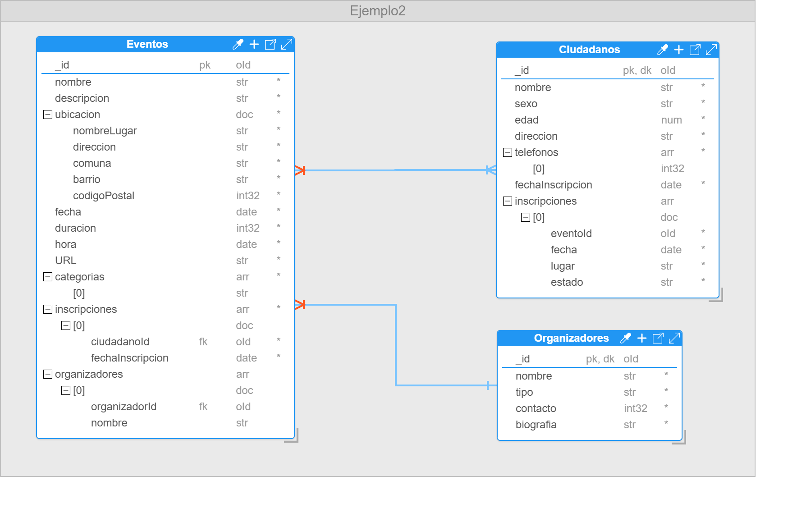

# Ejemplo 2: Aplicación de Gestión de Eventos Comunitarios

Imagina que estás desarrollando una plataforma de gestión para eventos comunitarios en una ciudad. La plataforma está destinada a permitir a los organizadores de eventos crear y gestionar actividades, y a los ciudadanos descubrir y participar en estos eventos.

Cada evento en la plataforma puede incluir una variedad de detalles como el nombre, la descripción, ubicación del evento, el cual deberá incluir nombre del lugar, dirección, comuna, barrio y código postal. Adicionalmente se deberá gestionar la fecha y hora de inicio, duración y un enlace para la inscripción. Además, los eventos pueden tener uno o más organizadores y pueden estar asociados a diferentes categorías, como arte, deportes, tecnología, y cultura. Los organizadores pueden ser tanto individuos como organizaciones, por tanto, es necesario gestionar un identificador único, nombre, tipo (persona u organización), contacto, y una breve biografía.

Los ciudadanos pueden participar en muchos eventos, pero para esto deberán ser mayores de edad y estar registrados en la plataforma mediante el nombre, sexo (masculino y femenino), edad, dirección, teléfonos de contacto, fecha de inscripción. Respecto a la inscripción en cada uno de los ciudadanos se debe guardar historial de cada una de las inscripciones de los ciudadanos en los eventos mediante una referencia al evento, fecha, lugar y estado (asistió, no asistió). Mientras que en los eventos solo se deberá registrar la referencia a cada uno de los ciudadanos que participaron y la fecha de inscripción. Por otro lado, los usuarios deben tener la capacidad de dejar comentarios y calificaciones sobre los eventos, lo que ayudará a otros usuarios a tomar decisiones informadas sobre qué eventos asistir.

Finalmente, es importante que la base de datos permita la desnormalización de datos para mejorar el rendimiento en las consultas.

> **Nota:** _En el contexto de bases de datos NoSQL, la desnormalización consiste en almacenar datos duplicados en varios lugares dentro de la base de datos. Esto implica agrupar información relevante en un solo documento, lo cual mejora el rendimiento de las consultas al permitir que todos los datos relevantes se puedan obtener en una sola lectura._

## Solución Ejemplo 2



**Figura 25. Solución Ejemplo 2**

## Script Base de Datos Ejemplo 2

**_Colección Eventos_**

```
db.createCollection("Eventos", {
    "capped": false,
    "validator": {
        "$jsonSchema": {
            "bsonType": "object",
            "title": "Eventos",
            "properties": {
                "_id": {
                    "bsonType": "objectId"
                },
                "nombre": {
                    "bsonType": "string"
                },
                "descripcion": {
                    "bsonType": "string"
                },
                "ubicacion": {
                    "bsonType": "object",
                    "properties": {
                        "nombreLugar": {
                            "bsonType": "string"
                        },
                        "direccion": {
                            "bsonType": "string"
                        },
                        "comuna": {

                            "bsonType": "string"
                        },
                        "barrio": {
                            "bsonType": "string"
                        },
                        "codigoPostal": {
                            "bsonType": "int"
                        }
                    },
                    "additionalProperties": false,
                    "required": [
                        "nombreLugar",
                        "direccion",
                        "comuna",
                        "barrio",
                        "codigoPostal"
                    ]
                },
                "fecha": {
                    "bsonType": "date"
                },
                "duracion": {
                    "bsonType": "int"
                },
                "hora": {
                    "bsonType": "date"
                },
                "URL": {
                    "bsonType": "string"
                },
                "categorias": {
                    "bsonType": "array",
                    "additionalItems": true,
                    "items": {
                        "bsonType": "string",
                        "enum": [
                            "arte",
                            "deporte",
                            "tecnologia",
                            "cultura"
                        ]
                    }
                },
                "inscripciones": {
                    "bsonType": "array",
                    "additionalItems": true,
                    "items": {
                        "bsonType": "object",
                        "properties": {
                            "ciudadanoId": {
                                "bsonType": "objectId"
                            },
                            "fechaInscripcion": {
                                "bsonType": "date"
                            }
                        },
                        "additionalProperties": false,
                        "required": [
                            "ciudadanoId",
                            "fechaInscripcion"
                        ]
                    }
                },
                "organizadores": {
                    "bsonType": "array",
                    "additionalItems": true,
                    "items": {
                        "bsonType": "object",
                        "properties": {
                            "organizadorId": {
                                "bsonType": "objectId"
                            },
                            "nombre": {
                                "bsonType": "string"
                            }
                        },
                        "additionalProperties": false
                    }
                }
            },
            "additionalProperties": true,
            "required": [
                "nombre",
                "descripcion",
                "ubicacion",
                "fecha",
                "duracion",
                "hora",
                "URL",
                "categorias",
                "inscripciones"
            ]
        }
    },
    "validationLevel": "moderate",
    "validationAction": "error"
});
```

**_Colección Ciudadanos_**

```
db.createCollection("Ciudadanos", {
    "capped": false,
    "validator": {
        "$jsonSchema": {
            "bsonType": "object",
            "title": "Ciudadanos",
            "properties": {
                "_id": {
                    "bsonType": "objectId"
                },
                "nombre": {
                    "bsonType": "string"
                },
                "sexo": {
                    "bsonType": "string",
                    "enum": [
                        "masculino",
                        "femenino"
                    ]
                },
                "edad": {
                    "bsonType": "number",
                    "minimum": 18
                },
                "direccion": {
                    "bsonType": "string"
                },
                "telefonos": {
                    "bsonType": "array",
                    "additionalItems": true,
                    "items": {
                        "bsonType": "int"
                    }
                },
                "fechaInscripcion": {
                    "bsonType": "date"
                },
                "inscripciones": {
                    "bsonType": "array",
                    "additionalItems": true,
                    "items": {
                        "bsonType": "object",
                        "properties": {
                            "eventoId": {
                                "bsonType": "objectId"
                            },
                            "fecha": {
                                "bsonType": "date"
                            },
                            "lugar": {
                                "bsonType": "string"
                            },
                            "estado": {
                                "bsonType": "string",
                                "enum": [
                                    "asistio",
                                    "noAsistio"
                                ]
                            }
                        },
                        "additionalProperties": false,
                        "required": [
                            "eventoId",
                            "fecha",
                            "lugar",
                            "estado"
                        ]
                    }
                }
            },
            "additionalProperties": true,
            "required": [
                "nombre",
                "sexo",
                "edad",
                "direccion",
                "telefonos",
                "fechaInscripcion",
                "inscripciones"
            ]
        }
    },
    "validationLevel": "moderate",
    "validationAction": "error"
});
```

**_Colección Organizadores_**

```
db.createCollection("Organizadores", {
    "capped": false,
    "validator": {
        "$jsonSchema": {
            "bsonType": "object",
            "title": "Organizadores",
            "properties": {
                "_id": {
                    "bsonType": "objectId"
                },
                "nombre": {
                    "bsonType": "string"
                },
                "tipo": {
                    "bsonType": "string",
                    "enum": [
                        "persona",
                        "organizacion"
                    ]
                },
                "contacto": {
                    "bsonType": "int"
                },
                "biografia": {
                    "bsonType": "string"
                }
            },
            "additionalProperties": true,
            "required": [
                "nombre",
                "tipo",
                "contacto",
                "biografia"
            ]
        }
    },
    "validationLevel": "moderate",
    "validationAction": "error"
});
```

## Conoce sobre el [Ecosistema de MongoDB 🍃➡️](/docs/06-Ecosistema-MongoDB/6.1-Ecosistema-de-MongoDB.md)
