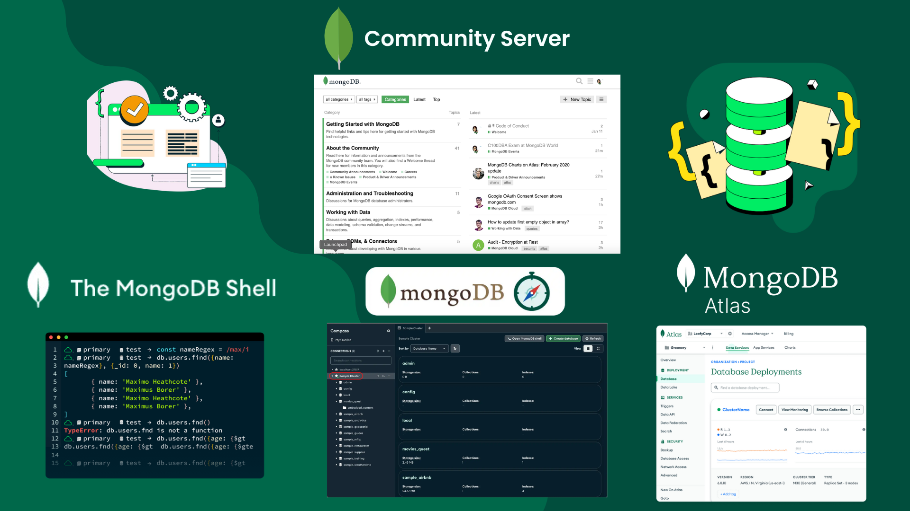

# Ecosistema de MongoDB

El ecosistema de MongoDB ofrece diferentes herramientas claves que facilitan la gestión y despliegue de bases de datos según las necesidades de los proyectos. Algunos de los elementos claves de este ecosistema incluyen: MongoDB Community Server, MongoDB Shell, MongoDB Compass y MongoDB Atlas.

