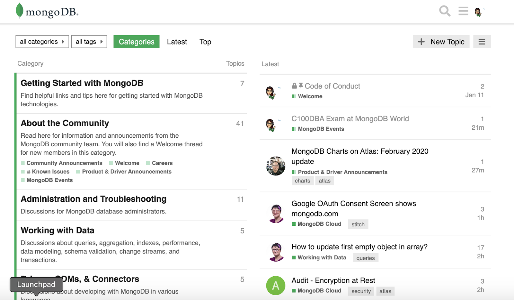

# MongoDB Community Server

Es el sistema de gestión de bases de datos de código abierto que permite almacenar y gestionar datos de manera eficiente para soportar diferentes tipos de aplicaciones (web, móviles, comercio electrónico, análisis de datos, IoT, redes sociales, geolocalización, etc.) que requieren de una alta flexibilidad y escalabilidad. Esta versión puede instalarse y ejecutarse en entornos locales autogestionados, ya sea en servidores propios, máquinas virtuales o en la nube sin las herramientas de administración que ofrece MongoDB Atlas.

## Lee sobre [MongoDB Shell 🐚➡️](6.3-MongoDB-Shell.md)
