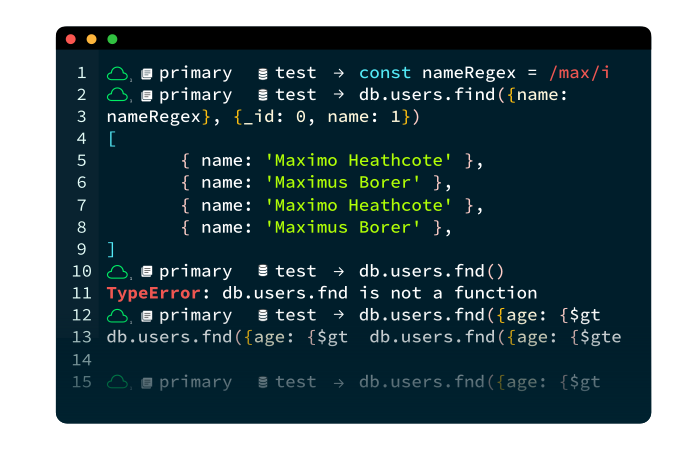

# MongoDB Shell

MongoDB Shell, también conocido como mongosh, es una interfaz de línea de comandos que permite interactuar con bases de datos tanto locales como desplegadas en la nube ​[[6]](../11-Referencias/11-Referencias-Modulo-2.md#6)​. Esta herramienta está basada en JavaScript y Node.js, proporciona un entorno interactivo REPL (Read-Eval-Print Loop) que resulta ideal para desarrolladores y administradores de bases de datos que utilizan MongoDB. A través de esta Shell interactiva, se pueden realizar consultas, manipular datos. Además de gestionar y mantener la base de datos en tiempo real. También, ofrece un entorno de programación sencillo que facilita la creación de scripts que permiten automatizar procesos repetitivos en la administración de una base de datos.

## Aprende acerca de [MongoDB Compass 🧭➡️](6.4-MongoDB-Compass.md)
