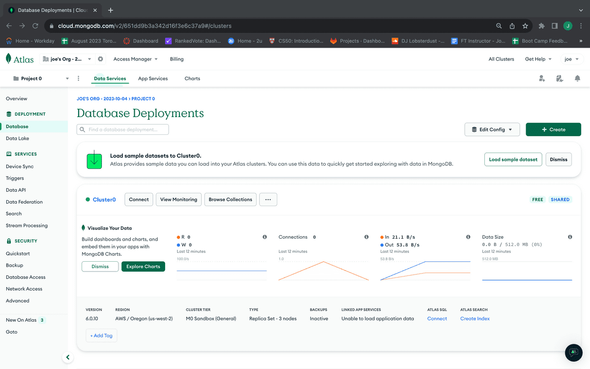

# MongoDB Atlas

Es una plataforma en la nube que facilita el despliegue de bases de datos, permitiendo a los usuarios almacenar y acceder a sus datos de manera sencilla desde cualquier lugar, sin tener que preocuparse por la infraestructura tecnológica subyacente. Además, ofrece la opción de alojar la base de datos de manera segura en proveedores como AWS, Microsoft Azure y Google Cloud, con opciones de tarifas gratuitas o de pago, según las necesidades del proyecto en términos de volumen de datos o disponibilidad.

> 🔜 **Continúa a la [siguiente sección](/docs/07-Operaciones-MongoDB/7.1-Gestion-de-Esquemas.md)**
