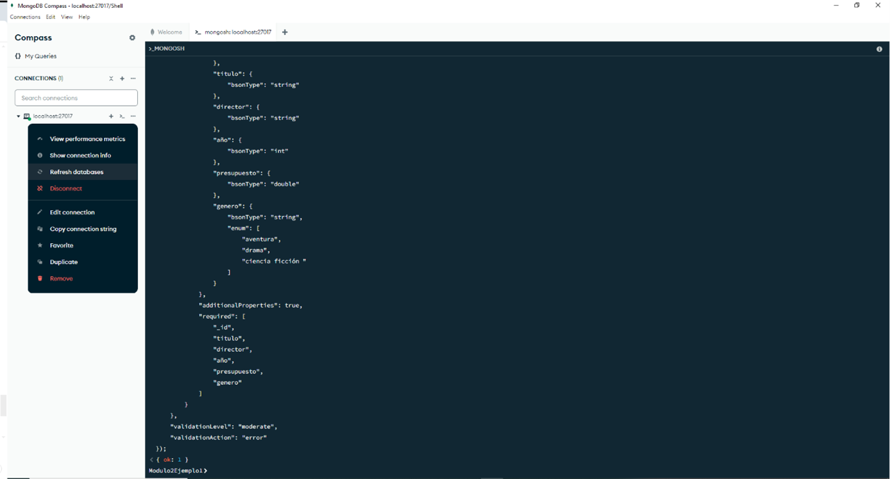

# Ejercicio práctico 1

El objetivo de este ejercicio será crear una base de datos de nombre Modulo2Ejemplo1 y se deberá crear una colección llamada películas con un esquema que incluya los siguientes campos obligatorios: **`título`** (cadena de texto), **`director`** (cadena de texto), **`año`** (entero), **`presupuesto`** (double) y **`genero`** (cadena de texto que permitirá almacenar películas del tipo aventura, drama y ciencia ficción). La base de datos deberá permitir que las colecciones sigan un nivel de validación moderado, controle el error y permita la adición de propiedades.

Requisito adicional, una vez creada la colección películas agregue el campo opcional **`estrellas`**, el cual será un arreglo de documentos embebidos compuesto por los campos obligatorios **`nombre`** (cadena de texto), **`año de nacimiento`** (entero) y **`nacionalidad`** (campo de texto). Y por último, el campo **`estado civil`** que deberá ser opcional.

**Instrucciones:**

- Abrir MongoDB Compass y crear la base de datos Modulo2Ejemplo1. Para crear la base de datos usaremos la shell como se puede observar en la Figura 1.


**Figura 1: MongoDB Compass - Mongosh**

- Ahora usa el comando **`“use”`** en la shell para crear la base de datos. Si la base de datos existe, permitirá cambiar de la base de datos actual “test” a la que se desea trabajar. En el caso de no existir se creará un espacio en memoria temporal con el nombre “Modulo2Ejemplo1” hasta que se realice una operación en ella (crear una colección o un documento).


**Figura 2: MongoDB Compass – Base de datos Modulo2Ejemplo1**

- Luego en Hackolade, se deberá modelar la colección mediante los requisitos especificados en el enunciado del problema.


**Figura 3: Base de Datos Modulo2Ejemplo1 - Hackolade**

```
db.createCollection("Peliculas", {
    "capped": false,
    "validator": {
        "$jsonSchema": {
            "bsonType": "object",
            "title": "Peliculas",
            "properties": {
                "_id": {
                    "bsonType": "objectId"
                },
                "titulo": {
                    "bsonType": "string"
                },
                "director": {
                    "bsonType": "string"
                },
                "año": {
                    "bsonType": "int"
                },
                "presupuesto": {
                    "bsonType": "double"
                },
                "genero": {
                    "bsonType": "string",
                    "enum": [
                        "aventura",
                        "drama",
                        "ciencia ficción "
                    ]
                }
            },
            "additionalProperties": true,
            "required": [
                "_id",
                "titulo",
                "director",
                "año",
                "presupuesto",
                "genero"
            ]
        }
    },
    "validationLevel": "moderate",
    "validationAction": "error"
});
```

- Copiar el script de la colección generado en Hackolade y correrlo en MongoDB Compass.


**Figura 4: Ejecutar Script - Colección Películas**

- Ahora, se deberá confirmar que la colección fue creada en la base datos. Por tanto, buscar en la consola de la shell si aparece la sentencia de respuesta **`{ ok: 1 }`**. También es posible realizar esta acción dando clic en el **`“show actions”`** del localhost:27017, es decir en los **`“…”`** y luego en el menú seleccionar la opción **`“Resfresh databases”`**. Una vez realizada esta acción debería aparecer la base de datos con la colección creada en la lista de bases de datos alojadas en el servidor.



**Figura 5: Actualizar el localhost**

- Verificar si la colección fue creada con éxito. Seleccionar de la base de datos la colección y luego dar clic en la pestaña **`“validation”`**. Aquí, se podrá observar el esquema creado, el nivel de “Validation”, etc.


**Figura 6: Verificar la Creación de la Colección Películas**

- Ahora, use el comando collMod para agregar el campo estrellas como parte del esquema, con los campos requeridos.

```
db.runCommand({
    "collMod": "Peliculas",
    "validator": {
        "$jsonSchema": {
            "bsonType": "object",
            "title": "Peliculas",
            "properties": {
                "_id": {
                    "bsonType": "objectId"
                },
                "titulo": {
                    "bsonType": "string"
                },
                "director": {
                    "bsonType": "string"
                },
                "año": {
                    "bsonType": "int"
                },
                "presupuesto": {
                    "bsonType": "double"
                },
                "genero": {
                    "bsonType": "string",
                    "enum": [
                        "aventura",
                        "drama",
                        "ciencia ficción "
                    ]
                },
                "estrellas": {
                    "bsonType": "array",
                    "additionalItems": true,
                    "items": {
                        "bsonType": "object",
                        "properties": {
                            "nombre": {
                                "bsonType": "string"
                            },
                            "añoNacimiento": {
                                "bsonType": "int"
                            },
                            "nacionalidad": {
                                "bsonType": "string"
                            },
                            "estadoCivil": {
                                "bsonType": "string"
                            }
                        },
                        "additionalProperties": false,
                        "required": [
                            "nombre",
                            "añoNacimiento",
                            "nacionalidad"
                        ]
                    }
                }
            },
            "additionalProperties": true,
            "required": [
                "_id",
                "titulo",
                "director",
                "año",
                "presupuesto",
                "genero"
            ]
        }
    },
    "validationLevel": "moderate",
    "validationAction": "error"
});
```

- Finalmente, verificar si el esquema fue actualizado de forma correcta. Para esta acción, es necesario cerrar y volver abrir MongoDB Compass, seleccionar la colección películas de la base de datos e ir a la pestaña “Validation”.


**Figura 7: Verificar la Actualización de la Colección Películas**
