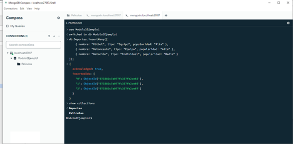
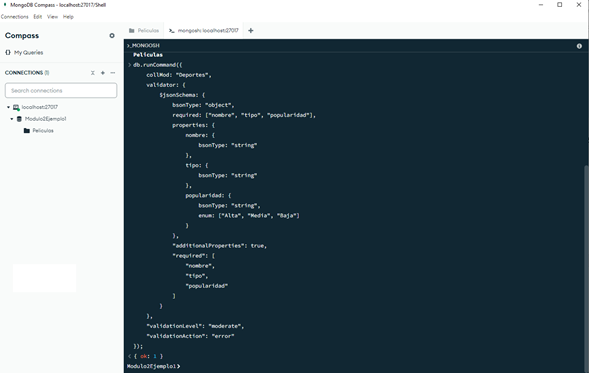
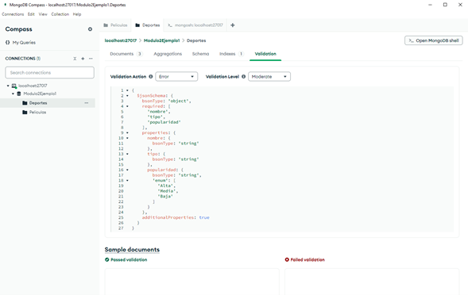

# Ejercicio práctico 2

Crear la colección Deportes en la base de datos Modulo2Ejemplo1 a través de la inserción de múltiples documentos. No se utilizará el comando **`createCollection()`**; en su lugar, MongoDB creará la colección de forma automática al insertar los documentos. Luego, se empleará el comando **`collMod`** para definir los tipos de datos que deben tener los campos de la colección y asegurarse que estos deben ser obligatorios. Finalmente, se establecerá un nivel de validación moderado, se habilitará el control de errores al insertar documentos y se facilitará la adición de nuevas propiedades.

**Instrucciones**

- Abrir la MongoDB Compass y usar el comando **`“use”`** en la shell para trabajar con la base de datos Modulo2Ejemplo1.

- Usar el método **`insertMany()`** para crear varios documentos en la colección Deportes.

```
db.Deportes.insertMany([
    { nombre: "Fútbol", tipo: "Equipo", popularidad: "Alta" },
    { nombre: "Baloncesto", tipo: "Equipo", popularidad: "Alta" },
    { nombre: "Natación", tipo: "Individual", popularidad: "Media" }
]);
```

- Al no existir la colección Deportes en la base de datos, MongoDB la creará de forma automática. Por tanto, verificar su creación ejecutando el comando **`show collections`** en la Shell, para ver la lista de colecciones existentes en la base de datos Modulo2Ejemplo1.



**Figura 8: Crear y Visualizar la Colección Deportes**

**_Nota:_** En MongoDB todo documento deberá tener un identificador único que, en caso de no especificarlo al crear un esquema o mediante la inserción de documentos, MongoDB lo generará automáticamente utilizando un ObjectId. El cual será un valor de 12 bytes que representa una cadena de texto en formato hexadecimal.

- Ahora, agregar el esquema de validación para la colección Deportes. Este esquema será aplicado a los nuevos documentos. Por tanto, ir a la shell y ejecutar el siguiente comando para agregar el esquema de validación a la colección Deportes.

```
db.runCommand({
    collMod: "Deportes",
    validator: {
        $jsonSchema: {
            bsonType: "object",
            required: ["nombre", "tipo", "popularidad"],
            properties: {
                nombre: {
                    bsonType: "string"
                },
                tipo: {
                    bsonType: "string"
                },
                popularidad: {
                    bsonType: "string",
                    enum: ["Alta", "Media", "Baja"]
                }
            },
            "additionalProperties": true,
            "required": [
                "nombre",
                "tipo",
                "popularidad"
            ]
        }
    },
    "validationLevel": "moderate",
    "validationAction": "error"
});
```



**Figura 9: Actualizar la Colección Deportes**

- Finalmente, refrescar las bases de datos en el localhost y verificar que la colección fue actualizada. Se deberá seleccionar la colección Depostes y luego abrir la pestaña “Validation”, en donde se podrá observar el esquema brindado.



**Figura 10: Verificar la Actualización de la Colección Deportes**
