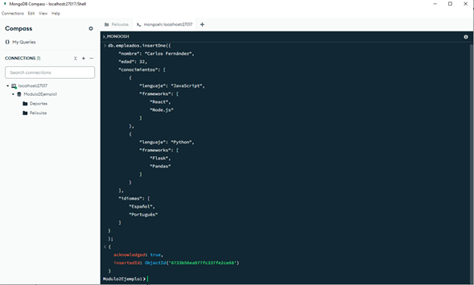
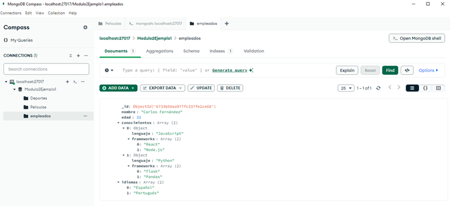
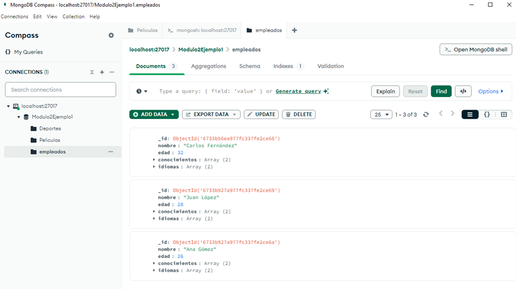

# Crear (Create)

Esta operación permite la creación de uno o varios documentos en una colección a través de métodos específicos. En MongoDB es posible realizar esta operación mediante el método **`insertOne()`** el cual permite insertar solo un documento o el método **`insertMany()`** para insertar varios documentos en una colección.

Estructura básica de un insertOne():

```
db.coleccion.insertOne({ campo1: valor1, campo2: valor2, ... });
```

**Ejemplo:**

```
db.empleados.insertOne({
    "nombre": "Carlos Fernández",
    "edad": 32,
    "conocimientos": [
        {
            "lenguaje": "JavaScript",
            "frameworks": [
                "React",
                "Node.js"
            ]
        },
        {
            "lenguaje": "Python",
            "frameworks": [
                "Flask",
                "Pandas"
            ]
        }
    ],
    "idiomas": [
        "Español",
        "Portugués"
    ]
}
);
```


**Figura 11: Método insertOne() - Empleados**

Recordemos, si la colección no existe MongoDB la creará de forma automática. Por tanto, refrescar el localhost, seleccionar de la base de datos la colección creada. Y ahora dar clic en la pestaña “Documents” para ver el documento creado.


**Figura 12: Visualizar Documentos Colección Empleados**

Estructura básica de un insertMany():

```
db.coleccion.insertMany([{documento1},{documento2}, ... ]);
```

**Ejemplo:**

```
db.empleados.insertMany([
  {
    "nombre": "Juan López",
    "edad": 28,
    "conocimientos": [
      {
        "lenguaje": "JavaScript",
        "frameworks": [
          "Angular",
          "Express"
        ]
      },
      {
        "lenguaje": "Java",
        "frameworks": [
          "Spring",
          "Hibernate"
        ]
      }
    ],
    "idiomas": [
      "Español",
      "Francés"
    ]
  },
  {
    "nombre": "Ana Gómez",
    "edad": 26,
    "conocimientos": [
      {
        "lenguaje": "JavaScript",
        "frameworks": [
          "Vue.js",
          "Express"
        ]
      },
      {
        "lenguaje": "Ruby",
        "frameworks": [
          "Rails",
          "Sinatra"
        ]
      }
    ],
    "idiomas": [
      "Español",
      "Inglés"
    ]
  }
]);
```

Una vez creados los documentos, seleccionar la colección empleados en la base de datos, dar clic en la pestaña “Documents”, buscar el icono de “Refresh documents” y dar clic.


**Figura 13: Refrescar Documentos - Empleados**

Una vez realizada esta acción se podrán visualizar todos los documentos creados para la colección empleados.



**Figura 14: Visualizar todos los Documentos de Empleados**
