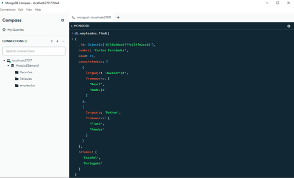

# Leer (Read)

Las operaciones de lectura permiten recuperar documentos de una colección en MongoDB. Esta recuperación puede realizarse de manera individual o en conjunto mediante el método **`find()`**. Para consultas más avanzadas que involucren transacciones, transformaciones o análisis de datos, se utiliza el método **`aggregate()`**. Este último permite construir un pipeline de agregación, compuesto por un conjunto de etapas diseñadas para aplicar filtros, realizar operaciones matemáticas o lógicas, y agrupar documentos según campos comunes o criterios específicos.

**Ejemplo:** Consultar todos los documentos de la colección empleados. Usar la instrucción db.empleados.find() en la shell.



**Figura 15: Consultar todos los Empleados mediante el método find()**

Con el método **`find()`**, es posible realizar consultas especificas mediante el uso de diferentes operadores, entre los principales se destacan:

**Operadores de comparación:** Permiten llevar a cabo comparaciones en una consulta, a través de los valores de un campo de los documentos pertenecientes a una colección. Algunos de estos son:

- **_$eq:_** Equal To. Significa Igual a (=). Permite seleccionar todos documentos en donde los valores de un campo coinciden con un valor especificado.

  **Ejemplo:** Consultar qué empleados tiene en su lista de idioma el Francés.

  ```
  db.empleados.find({ "idiomas": { "$eq": "Francés" } })
  ```

  Otra forma, es realizar esta consulta de forma implícita:

  ```
  db.empleados.find({ "idiomas": "Francés" })
  ```

- **_$gt:_** Greater Than. Significa mayor que (>). Selecciona todos los documentos en donde los valores de un campo coinciden que son mayores al valor especificado.

  **Ejemplo:** Consultar que empleados tienen una edad mayor a 20 años.

  ```
  db.empleados.find({ "edad": { "$gt": 20 } })
  ```

- **_$gte:_** Greater Than or Equal To. Significa mayor o igual que (>=). Selecciona todos los documentos en donde los valores de un campo coinciden que son mayores o iguales al valor especificado.

  **Ejemplo:** Consultar que empleados tienen una edad mayor o igual a 30 años.

  ```
  db.empleados.find({ "edad": { "$gte": 30 } })
  ```

- **_$lt:_** Less Than. Significa menor que (<). Selecciona todos los documentos en donde los valores de un campo coinciden que son menores al valor especificado.

  **Ejemplo:** Consultar que empleados tienen una edad menor a 30 años.

  ```
  db.empleados.find({ "edad": { "$lt": 30 } })
  ```

- **_$lte:_** Less Than or Equal To. Significa menor o igual que (<=). Selecciona todos los documentos en donde los valores de un campo coinciden que son menores o iguales al valor especificado.

  **Ejemplo:** Consultar que empleados tienen una edad menor o igual a 32 años.

  ```
  db.empleados.find({ "edad": { "$lte": 32 } })
  ```

- **_$ne:_** Not equal. Significa no igual a. Selecciona todos los documentos en donde los valores de un campo no son iguales al valor especificado.

  **Ejemplo:** Consultar que empleados no tiene en su lista de idioma el Inglés.

  ```
  db.empleados.find({ "idiomas": { "$ne": "Inglés" } })
  ```

**_Nota:_** _En MongoDB, los operadores de comparación como **`$gte`**, **`$gt`**, **`$lt`**, y **`$lte`** están diseñados para realizar comparaciones numéricas, siendo este su uso común y natural. Sin embargo, también pueden aplicarse a fechas y strings, siempre que la comparación tenga sentido lógico._

**_Ejemplos:_**

- En el caso de fechas. Si quisiéramos consultar que empleados han sido contratados después del 1 de enero de 2024:

  ```
  db.empleados.find({ "fechaContratacion": { "$gt": new Date("2024-01-01") } })
  ```

- En el caso de comparación de string. Si quisiéramos encontrar los empleados cuyos nombres estén alfabéticamente después de "Diego":

  ```
  db.empleados.find({ "nombre": { "$gt": "Diego" } })
  ```

**Operadores Lógicos:** Permiten construir consultas complejas mediante expresiones booleanas que evalúan condiciones como verdaderas o falsas. Estos operadores facilitan la combinación de múltiples condiciones de búsqueda, mejorando la capacidad para filtrar documentos de manera más eficiente. Algunos de estos son:

- **_$and:_** Combina varias condiciones en una consulta y exige que todas sean verdaderas.

  **Ejemplo:** Consultar que empleados hablan español y francés y que tengas más de 25 años.

  ```
  db.empleados.find({
      $and: [
              { "idiomas": "Español" },
              { "idiomas": "Inglés" },
              { "edad": { $gt: 25 } }
      ]
  });
  ```

  **_Nota:_** _La coma “,” entre las condiciones o filtros de una consulta actúa como un $and implícito._

  **Ejemplo:**

  ```
  db.empleados.find({ edad: { $gte: 30 }, "conocimientos.lenguaje": "JavaScript" })
  ```

- **_$or:_** Combina varias condiciones en una consulta y exige que al menos una sea verdadera.

  **Ejemplo:** Consultar que empleados tienen conocimiento en Java o Ruby.

  ```
  db.empleados.find({
  $or: [
      { "conocimientos.lenguaje": "Java" },
      { "conocimientos.lenguaje": "Ruby" }
  ]
  })
  ```

- **_$not:_** Invierte o niega una condición en una consulta. Retorna los documentos que no coinciden con la condición especificada.

  **Ejemplo:** Consultar que empleados no hablan Inglés.

  ```
  db.empleados.find({
      "idiomas": {
      $not: { $eq: "Inglés" }
      }
  });
  ```

- **_$nor:_** Combina varias condiciones en una consulta y exige que ninguna de las condiciones sea verdadera. Es el inverso de **`$or`**.

  **Ejemplo:** Consultar qué empleados saben JavaScript pero no tienen experiencia con Angular ni Express en sus frameworks asociados.

  ```
  db.empleados.find({
      "conocimientos.lenguaje": "JavaScript",
      $nor: [
            { "conocimientos.frameworks": "Angular" },
            { "conocimientos.frameworks": "Express" }
        ]
  })
  ```

**Operadores de Ordenamiento:** En el contexto de MongoDB el principal operador de ordenamiento en las consultas como en las agregaciones es el **`$sort`**. Este método permite controlar el ordenamiento mediante el uso del 1 (para el orden ascendente) y -1 (para el orden descendente).

**_Ejemplo a:_** Consultar todos los empleados y ordenar los resultados por la edad en orden ascendente (de menor a mayor):

```
db.empleados.find().sort({ edad: 1 })
```

**_Ejemplo b:_** Consultar todos los empleados y ordenar los resultados por nombre en orden descendente (de la Z a la A).

```
db.empleados.find().sort({ nombre: -1 })
```

**Operadores de Proyección:** En el contexto de las consultas básicas con el método **`find()`**, la proyección permite especificar qué campos de una colección se desean incluir (1) o excluir (0) en los resultados. Para consultas más complejas, transacciones o en operaciones avanzadas que utilizan el pipeline de agregación, se emplea el operador **`$project`**.
_Estructura básica:_

```
db.colección.find({filtro},{proyección})
```

- **_Filtro:_** Especifica qué documentos deben ser recuperados de la colección. Si la proyección es vacía {}, MongoDB devolverá todos los documentos de la colección sin aplicar ningún filtro.

- **_Proyección:_** Determina qué campos incluir (1) o excluir (0) en los resultados.

**Ejemplo:** Consultar los empleados cuya edad esté entre 27 y 32 años, mostrando únicamente los campos **`"nombre"`** e **`"idiomas"`**, y excluyendo el **`campo _id`**.

```
db.empleados.find(
  { "edad": { $gte: 27, $lte: 32 } }, // filtro: edad entre 27 y 32 años
  { "nombre": 1, "idiomas": 1, _id: 0 } // proyección: incluir "nombre" e "idiomas", excluir "_id"
);
```
