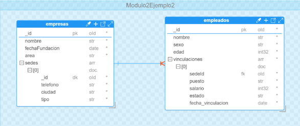

# Operaciones de agregación 
La agregación es una funcionalidad potente de MongoDB que facilita consultas avanzadas en una o más colecciones. Permite la transformación de datos, incluyendo la modificación de estructuras de documentos y la proyección de campos resultantes ​[[9]](../11-Referencias/11-Referencias-Modulo-2.md#9). Mediante la agregación, podemos realizar análisis de datos complejos, como la identificación de tendencias y el procesamiento de datos (cálculos, operaciones matemáticas, lógicas, conteos, entre otros), a través de un conjunto de etapas conocidas como el “pipeline de agregación” ​​[[10]](../11-Referencias/11-Referencias-Modulo-2.md#10). Este pipeline nos permite aplicar una serie de transformaciones secuenciales a los documentos de una colección, pasándolos por cada etapa sucesiva. Es decir, un pipeline es una secuencia de etapas que procesan los documentos en una agregación. 

En MongoDB, las agregaciones se realizan mediante el uso del método aggregate(), en donde se podrán especificar cada una de las etapas que se aplicarán a los documentos de una colección. Una agregación siempre se aplicará a partir de una colección origen, pero podrá involucrar más colecciones mediante etapas. En la *Figura 16* se presenta el esquema básico de una agregación. 


**Figura 16. Pipeline del Método aggregate()**

## En esencia, las operaciones de agregación procesan y analizan conjuntos de registros de datos para devolver resultados calculados. También permiten agrupar valores de distintos documentos y realizar operaciones variadas con los datos agrupados, con el objetivo de obtener un resultado consolidado. 

- *$match:* Permite agrupar documentos por un campo específico. Además, permite realizar operaciones de agregación como conteos, sumas o promedios, entre otras.

- *$project:* Permite incluir o excluir campos de los documentos. Además, ofrece la oportunidad de crear nuevos cuando es necesario crear campos calculados. 

- *$sort:* Ordenar los documentos de acuerdo con uno o varios campos. 

- *$limit:* Se utiliza para limitar el número de documentos que pasan a través de un pipeline. 

- *$lookup:* Se utiliza para llevar a cabo la unión entre colecciones mediante atributos comunes. Similar al JOIN en SQL. 

- *$unwin:* Permite descomponer los campos de tipo array pertenecientes a los documentos de una colección o los generados mediante la aplicación del operador *$lookup* en múltiples documentos individuales.

          ## _*Nota: Las etapas de un pipeline de una agregación nos son consideradas como
          operadores. Pero estas etapas si hacen uso de operadores para realizar las
          operaciones específicas sobre los datos de los documentos asociados en una
          agregación.*_
  


**Figura 17: Esquema de Documentos Base de Datos Modulo2Ejemplo2 **

## MongoDB Script

```
use Modulo2Ejemplo2 

 

db.createCollection("empresas", { 

    "capped": false, 

    "validator": { 

        "$jsonSchema": { 

            "bsonType": "object", 

            "title": "empresas", 

            "properties": { 

                "_id": { 

                    "bsonType": "objectId" 

                }, 

                "nombre": { 

                    "bsonType": "string" 

                }, 

                "fechaFundacion": { 

                    "bsonType": "date" 

                }, 

                "area": { 

                    "bsonType": "string" 

                }, 

                "sedes": { 

                    "bsonType": "array", 

                    "additionalItems": true, 

                    "items": { 

                        "bsonType": "object", 

                        "properties": { 

                            "_id": { 

                                "bsonType": "objectId" 

                            }, 

                            "telefono": { 

                                "bsonType": "string" 

                            }, 

                            "ciudad": { 

                                "bsonType": "string" 

                            }, 

                            "tipo": { 

                                "bsonType": "string", 

                                "enum": [ 

                                    "sede central", 

                                    "sucursal" 

                                ] 

                            } 

                        }, 

                        "additionalProperties": false, 

                        "required": [ 

                            "_id", 

                            "telefono", 

                            "ciudad", 

                            "tipo" 

                        ] 

                    } 

                } 

            }, 

            "additionalProperties": true, 

            "required": [ 

                "_id", 

                "nombre", 

                "fechaFundacion", 

                "area" 

            ] 

        } 

    }, 

    "validationLevel": "moderate", 

    "validationAction": "error" 

}); 

 

db.createCollection("empleados", { 

    "capped": false, 

    "validator": { 

        "$jsonSchema": { 

            "bsonType": "object", 

            "title": "empleados", 

            "properties": { 

                "_id": { 

                    "bsonType": "objectId" 

                }, 

                "nombre": { 

                    "bsonType": "string" 

                }, 

                "sexo": { 

                    "bsonType": "string", 

                    "enum": [ 

                        "M", 

                        "H" 

                    ] 

                }, 

                "edad": { 

                    "bsonType": "int" 

                }, 

                "vinculaciones": { 

                    "bsonType": "array", 

                    "additionalItems": true, 

                    "items": { 

                        "bsonType": "object", 

                        "properties": { 

                            "sedeId": { 

                                "bsonType": "objectId" 

                            }, 

                            "puesto": { 

                                "bsonType": "string" 

                            }, 

                            "salario": { 

                                "bsonType": "int" 

                            }, 

                            "estado": { 

                                "bsonType": "string", 

                                "enum": [ 

                                    "activo", 

                                    "inactivo" 

                                ] 

                            }, 

                            "fecha_vinculacion": { 

                                "bsonType": "date" 

                            } 

                        }, 

                        "additionalProperties": false, 

                        "required": [ 

                            "sedeId", 

                            "puesto", 

                            "salario", 

                            "estado", 

                            "fecha_vinculacion" 

                        ] 

                    } 

                } 

            }, 

            "additionalProperties": true, 

            "required": [ 

                "_id", 

                "nombre", 

                "sexo", 

                "edad", 

                "vinculaciones" 

            ] 

        } 

    }, 

    "validationLevel": "moderate", 

    "validationAction": "error" 

}); 
```

## Documentos base

```
const sedeCentralId = ObjectId(); 

const sedeBogotaId = ObjectId(); 

const sedeMedellinId = ObjectId(); 

const sedeBarranquillaId = ObjectId(); 

 

db.empresas.insertOne({  

  "nombre": "DevSoft S.A", 

  "fechaFundacion": new Date("2023-01-10"), 

  "area":"Servicios y Desarrollo de software", 

  "sedes":[ 

           {"_id":sedeCentralId,"telefono": "123-456-789", "ciudad": "Cali", "tipo":"sede central"}, 

           {"_id":sedeBogotaId,"telefono": "987-654-321", "ciudad": "Bogotá", "tipo":"sucursal"}, 

           {"_id":sedeMedellinId,"telefono": "555-444-333", "ciudad": "Medellín","tipo":"sucursal" }, 

           {"_id":sedeBarranquillaId,"telefono": "435-123-222", "ciudad": "Barranquilla", "tipo":"sucursal"} 

  ] 

}); 

 

db.empleados.insertMany([ 

  { 

    "nombre": "Juan Pérez", 

    "sexo": "H", 

    "edad": 30, 

    "vinculaciones": [ 

      { 

        "sedeId": sedeCentralId, 

        "puesto": "Desarrollador", 

        "salario": 3000, 

        "estado": "activo", 

        "fecha_vinculacion": new Date("2023-01-10") 

      } 

    ] 

  }, 

  { 

    "nombre": "Ana Gómez", 

    "sexo": "M", 

    "edad": 28, 

    "vinculaciones": [ 

      { 

        "sedeId": sedeCentralId, 

        "puesto": "Analista", 

        "salario": 2500, 

        "estado": "activo", 

        "fecha_vinculacion": new Date("2023-01-10") 

      } 

    ] 

  }, 

  { 

    "nombre": "Carlos Díaz", 

    "sexo": "H", 

    "edad": 35, 

    "vinculaciones": [ 

      { 

        "sedeId": sedeBogotaId, 

        "puesto": "Desarrollador", 

        "salario": 3500, 

        "estado": "activo", 

        "fecha_vinculacion": new Date("2023-02-01") 

      } 

    ] 

  }, 

  { 

    "nombre": "Luisa Martínez", 

    "sexo": "M", 

    "edad": 40, 

    "vinculaciones": [ 

      { 

        "sedeId": sedeBogotaId, 

        "puesto": "Gerente", 

        "salario": 5000, 

        "estado": "activo", 

        "fecha_vinculacion": new Date("2023-02-15") 

      } 

    ] 

  }, 

  { 

    "nombre": "Pedro García", 

    "sexo": "H", 

    "edad": 25, 

    "vinculaciones": [ 

      { 

        "sedeId": sedeMedellinId, 

        "puesto": "Desarrollador", 

        "salario": 2800, 

        "estado": "activo", 

        "fecha_vinculacion": new Date("2023-03-01") 

      } 

    ] 

  }, 

  { 

    "nombre": "María López", 

    "sexo": "M", 

    "edad": 32, 

    "vinculaciones": [ 

      { 

        "sedeId": sedeMedellinId, 

        "puesto": "Analista", 

        "salario": 3000, 

        "estado": "activo", 

        "fecha_vinculacion": new Date("2023-03-05") 

      } 

    ] 

  }, 

  { 

    "nombre": "Ricardo Ortega", 

    "sexo": "H", 

    "edad": 27, 

    "vinculaciones": [ 

      { 

        "sedeId": sedeBarranquillaId, 

        "puesto": "Soporte Técnico", 

        "salario": 2600, 

        "estado": "activo", 

        "fecha_vinculacion": new Date("2023-04-01") 

      } 

    ] 

  }, 

  { 

    "nombre": "Laura Méndez", 

    "sexo": "M", 

    "edad": 29, 

    "vinculaciones": [ 

      { 

        "sedeId": sedeBarranquillaId, 

        "puesto": "Diseñadora", 

        "salario": 2700, 

        "estado": "activo", 

        "fecha_vinculacion": new Date("2023-04-10") 

      } 

    ] 

  } 

]); 
```
## Agregaciones Simples 

Las agregaciones simples en MongoDB permiten realizar operaciones básicas sobre los documentos de una colección. Algunas de las operaciones más empleadas en las etapas incluyen entre otras el $match, $project, $limit, $sort, etc.  

##
