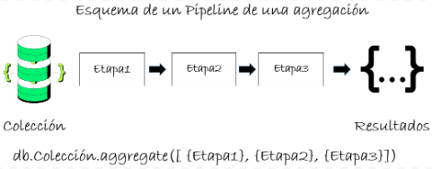

# Operaciones de agregación 

La agregación es una funcionalidad potente de MongoDB que facilita consultas avanzadas en una o más colecciones. Permite la transformación de datos, incluyendo la modificación de estructuras de documentos y la proyección de campos resultantes ​[[9]](../11-Referencias/11-Referencias-Modulo-2.md#9). Mediante la agregación, podemos realizar análisis de datos complejos, como la identificación de tendencias y el procesamiento de datos (cálculos, operaciones matemáticas, lógicas, conteos, entre otros), a través de un conjunto de etapas conocidas como el “**pipeline de agregación**” ​​[[10]](../11-Referencias/11-Referencias-Modulo-2.md#10). Este pipeline nos permite aplicar una serie de transformaciones secuenciales a los documentos de una colección, pasándolos por cada etapa sucesiva. Es decir, un pipeline es una secuencia de etapas que procesan los documentos en una agregación. 

En MongoDB, las agregaciones se realizan mediante el uso del método **aggregate()**, en donde se podrán especificar cada una de las etapas que se aplicarán a los documentos de una colección. Una agregación siempre se aplicará a partir de una colección origen, pero podrá involucrar más colecciones mediante etapas. En la *Figura 16* se presenta el esquema básico de una agregación. 

**Figura 16. Pipeline del Método aggregate()**
## 

En esencia, las operaciones de agregación procesan y analizan conjuntos de registros de datos para devolver resultados calculados. También permiten agrupar valores de distintos documentos y realizar operaciones variadas con los datos agrupados, con el objetivo de obtener un resultado consolidado. 

> ### **👉 Aprende acerca de las [Etapas de Agregación 🧮](8.2-Etapas-de-Agregacion.md)**
