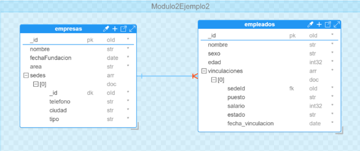

# Etapas de Agregación

Las etapas de una agregación son un conjunto de operaciones fundamentales del framework de agregación de MongoDB (Conjunto de herramientas que facilitan el procesamiento y análisis de forma directa en la base de datos [[9]](../11-Referencias/11-Referencias-Modulo-2.md#9)​, [[11]](../11-Referencias/11-Referencias-Modulo-2.md#11)​).  

En una agregación, cada etapa recibe documentos de entrada para realizar una operación sobre ellos y producir documentos de salida para cada etapa del pipeline. Algunas de los operadores más comunes usados en las etapas de una agregación son: 

- `🔍$match:` Permite agrupar documentos por un campo específico. Además, permite realizar operaciones de agregación como conteos, sumas o promedios, entre otras.

- `📐$project:` Permite incluir o excluir campos de los documentos. Además, ofrece la oportunidad de crear nuevos cuando es necesario crear campos calculados. 

- `↕️$sort:` Ordenar los documentos de acuerdo con uno o varios campos. 

- `🔢$limit:` Se utiliza para limitar el número de documentos que pasan a través de un pipeline. 

- 🔗`$lookup:` Se utiliza para llevar a cabo la unión entre colecciones mediante atributos comunes. Similar al JOIN en SQL. 

- `🌀$unwind:` Permite descomponer los campos de tipo array pertenecientes a los documentos de una colección o los generados mediante la aplicación del operador *$lookup* en múltiples documentos individuales.

 _**Nota:** Las etapas de un pipeline de una agregación nos son consideradas como
          operadores. Pero estas etapas si hacen uso de operadores para realizar las
          operaciones específicas sobre los datos de los documentos asociados en una
          agregación._
  


**Figura 17: Esquema de Documentos Base de Datos Modulo2Ejemplo2**

## _**MongoDB Script**_

```
use Modulo2Ejemplo2 

db.createCollection("empresas", { 

    "capped": false, 

    "validator": { 

        "$jsonSchema": { 

            "bsonType": "object", 

            "title": "empresas", 

            "properties": { 

                "_id": { 

                    "bsonType": "objectId" 

                }, 

                "nombre": { 

                    "bsonType": "string" 

                }, 

                "fechaFundacion": { 

                    "bsonType": "date" 

                }, 

                "area": { 

                    "bsonType": "string" 

                }, 

                "sedes": { 

                    "bsonType": "array", 

                    "additionalItems": true, 

                    "items": { 

                        "bsonType": "object", 

                        "properties": { 

                            "_id": { 

                                "bsonType": "objectId" 

                            }, 

                            "telefono": { 

                                "bsonType": "string" 

                            }, 

                            "ciudad": { 

                                "bsonType": "string" 

                            }, 

                            "tipo": { 

                                "bsonType": "string", 

                                "enum": [ 

                                    "sede central", 

                                    "sucursal" 

                                ] 

                            } 

                        }, 

                        "additionalProperties": false, 

                        "required": [ 

                            "_id", 

                            "telefono", 

                            "ciudad", 

                            "tipo" 

                        ] 

                    } 

                } 

            }, 

            "additionalProperties": true, 

            "required": [ 

                "_id", 

                "nombre", 

                "fechaFundacion", 

                "area" 

            ] 

        } 

    }, 

    "validationLevel": "moderate", 

    "validationAction": "error" 

}); 

db.createCollection("empleados", { 

    "capped": false, 

    "validator": { 

        "$jsonSchema": { 

            "bsonType": "object", 

            "title": "empleados", 

            "properties": { 

                "_id": { 

                    "bsonType": "objectId" 

                }, 

                "nombre": { 

                    "bsonType": "string" 

                }, 

                "sexo": { 

                    "bsonType": "string", 

                    "enum": [ 

                        "M", 

                        "H" 

                    ] 

                }, 

                "edad": { 

                    "bsonType": "int" 

                }, 

                "vinculaciones": { 

                    "bsonType": "array", 

                    "additionalItems": true, 

                    "items": { 

                        "bsonType": "object", 

                        "properties": { 

                            "sedeId": { 

                                "bsonType": "objectId" 

                            }, 

                            "puesto": { 

                                "bsonType": "string" 

                            }, 

                            "salario": { 

                                "bsonType": "int" 

                            }, 

                            "estado": { 

                                "bsonType": "string", 

                                "enum": [ 

                                    "activo", 

                                    "inactivo" 

                                ] 

                            }, 

                            "fecha_vinculacion": { 

                                "bsonType": "date" 

                            } 

                        }, 

                        "additionalProperties": false, 

                        "required": [ 

                            "sedeId", 

                            "puesto", 

                            "salario", 

                            "estado", 

                            "fecha_vinculacion" 

                        ] 

                    } 

                } 

            }, 

            "additionalProperties": true, 

            "required": [ 

                "_id", 

                "nombre", 

                "sexo", 

                "edad", 

                "vinculaciones" 

            ] 

        } 

    }, 

    "validationLevel": "moderate", 

    "validationAction": "error" 

}); 
```

## _**Documentos base**_


```
const sedeCentralId = ObjectId(); 

const sedeBogotaId = ObjectId(); 

const sedeMedellinId = ObjectId(); 

const sedeBarranquillaId = ObjectId(); 

db.empresas.insertOne({  

  "nombre": "DevSoft S.A", 

  "fechaFundacion": new Date("2023-01-10"), 

  "area":"Servicios y Desarrollo de software", 

  "sedes":[ 

           {"_id":sedeCentralId,"telefono": "123-456-789", "ciudad": "Cali", "tipo":"sede central"}, 

           {"_id":sedeBogotaId,"telefono": "987-654-321", "ciudad": "Bogotá", "tipo":"sucursal"}, 

           {"_id":sedeMedellinId,"telefono": "555-444-333", "ciudad": "Medellín","tipo":"sucursal" }, 

           {"_id":sedeBarranquillaId,"telefono": "435-123-222", "ciudad": "Barranquilla", "tipo":"sucursal"} 

  ] 

}); 

db.empleados.insertMany([ 

  { 

    "nombre": "Juan Pérez", 

    "sexo": "H", 

    "edad": 30, 

    "vinculaciones": [ 

      { 

        "sedeId": sedeCentralId, 

        "puesto": "Desarrollador", 

        "salario": 3000, 

        "estado": "activo", 

        "fecha_vinculacion": new Date("2023-01-10") 

      } 

    ] 

  }, 

  { 

    "nombre": "Ana Gómez", 

    "sexo": "M", 

    "edad": 28, 

    "vinculaciones": [ 

      { 

        "sedeId": sedeCentralId, 

        "puesto": "Analista", 

        "salario": 2500, 

        "estado": "activo", 

        "fecha_vinculacion": new Date("2023-01-10") 

      } 

    ] 

  }, 

  { 

    "nombre": "Carlos Díaz", 

    "sexo": "H", 

    "edad": 35, 

    "vinculaciones": [ 

      { 

        "sedeId": sedeBogotaId, 

        "puesto": "Desarrollador", 

        "salario": 3500, 

        "estado": "activo", 

        "fecha_vinculacion": new Date("2023-02-01") 

      } 

    ] 

  }, 

  { 

    "nombre": "Luisa Martínez", 

    "sexo": "M", 

    "edad": 40, 

    "vinculaciones": [ 

      { 

        "sedeId": sedeBogotaId, 

        "puesto": "Gerente", 

        "salario": 5000, 

        "estado": "activo", 

        "fecha_vinculacion": new Date("2023-02-15") 

      } 

    ] 

  }, 

  { 

    "nombre": "Pedro García", 

    "sexo": "H", 

    "edad": 25, 

    "vinculaciones": [ 

      { 

        "sedeId": sedeMedellinId, 

        "puesto": "Desarrollador", 

        "salario": 2800, 

        "estado": "activo", 

        "fecha_vinculacion": new Date("2023-03-01") 

      } 

    ] 

  }, 

  { 

    "nombre": "María López", 

    "sexo": "M", 

    "edad": 32, 

    "vinculaciones": [ 

      { 

        "sedeId": sedeMedellinId, 

        "puesto": "Analista", 

        "salario": 3000, 

        "estado": "activo", 

        "fecha_vinculacion": new Date("2023-03-05") 

      } 

    ] 

  }, 

  { 

    "nombre": "Ricardo Ortega", 

    "sexo": "H", 

    "edad": 27, 

    "vinculaciones": [ 

      { 

        "sedeId": sedeBarranquillaId, 

        "puesto": "Soporte Técnico", 

        "salario": 2600, 

        "estado": "activo", 

        "fecha_vinculacion": new Date("2023-04-01") 

      } 

    ] 

  }, 

  { 

    "nombre": "Laura Méndez", 

    "sexo": "M", 

    "edad": 29, 

    "vinculaciones": [ 

      { 

        "sedeId": sedeBarranquillaId, 

        "puesto": "Diseñadora", 

        "salario": 2700, 

        "estado": "activo", 

        "fecha_vinculacion": new Date("2023-04-10") 

      } 

    ] 

  } 

]); 
```

> ### 👉 **Continúa al tema de [Agregaciones simples ➕](8.3-Agregaciones-Simples/8.3-Agregaciones-Simples.md)**
