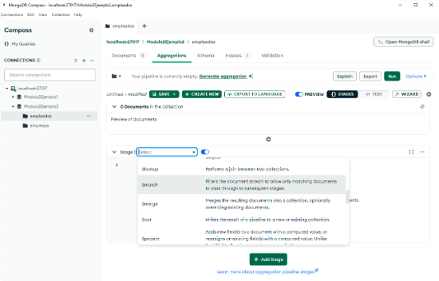
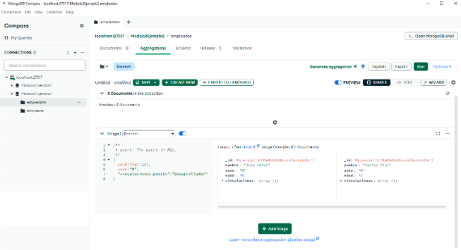

# Ejemplo práctico 1 

Se requiere obtener cuáles son los empleados mayores de 28 años, de sexo hombre y que tienen una vinculación activa como desarrollador. Además, se requiere visualizar los campos nombre, edad y salario, ordenando los resultados de forma descendente por la edad.
 
 
Para crear una agregación en MongoDB Compass se deberá seleccionar la base de datos (Modulo2Ejemplo2) y la colección que servirá como punto de partida, en este caso “**empleados**”. Dar clic en la pestaña “**Agregations**” para crear la agregación a través de la interfaz gráfica, como se puede apreciar en la **Figura 18**. 

 

 
 ## _**Etapa 1: Filtrado con $match**_
 
 Para iniciar, usar el operador $match para seleccionar solo los documentos que cumplan con los criterios especificados: 
 
 - Edad mayor a 28 años. 
 
 - Sexo masculino “H”. 
 
 - Vinculación activa con el puesto "Desarrollador". 
 
 El operador $match ayuda a filtrar los documentos antes de procesarlos en etapas posteriores. Para adicionar esta etapa y especificar los criterios dar clic en el botón “**+ Add Stage**” 
 
 
 
 **Figura 19: Adicionar una Etapa a un Pipeline de Agregaciones**
 
 _**Nota:** MongoDB diferencia entre mayúsculas y minúsculas, tanto en nombres de campos como en los valores de texto asociados. Por tanto, es importante asegurarse que coincidan correctamente._
 
 
 
 **Figura 20: Especificar la Etapa 1 Mediante el Operador $match**
 
 El resultado de aplicar el filtro se puede apreciar en la salida de la etapa que ofrece MongoDB Compass. 
 
 ## _**Etapa 2: Ordenamiento con $sort**_
 
 Una vez filtrados los documentos, ordenar los resultados por el campo edad en orden descendente. Para ello, utilizar el operador $sort, especificando -1 para el orden descendente: 
 
 En la salida de la etapa se puede observar que los documentos fueron ordenados por la edad. 
 
 
 
 
  _**Figura 21: Especificar la Etapa 2 Mediante el Operador $sort**_
 
 El resultado de esta etapa reorganiza los documentos según el valor de la edad, facilitando la presentación de los datos. 
 
 ## _**Etapa 3: Descomposición de arreglos con $unwind**_
 
 Los documentos contienen un arreglo llamado vinculaciones, que almacena información sobre los puestos y salarios. Para acceder al salario de cada desarrollador, se deberá usar el operador $unwind, que convierte cada elemento del arreglo en un documento independiente. Este operador es útil cuando se necesita trabajar con elementos individuales de un arreglo en lugar del arreglo por completo. Por tanto, especificar el campo path, con el nombre del arreglo que se desea descomponer en documento individuales. 
 
  
  
 
 _**Figura 22: Especificar la Etapa 3 Mediante el Operador $unwind**_
 
 _Nota: Se antepone “$" antes del arreglo para poder acceder al valor de los campos de un documento, en este caso el arreglo que se va a descomponer._
 
 ## _**Etapa 4: Proyección con $project**_
 
 Finalmente, especificar los campos a mostrar en los resultados: nombre, edad y salario. Usar el operador $project el cual permite incluir (1) o excluir (0) campos específicos en la salida de una agregación. También se deberá referenciar el campo salario que se encuentra dentro de vinculaciones. El resultado de esta etapa se presenta en la **Figura 23**. 
      
 
 
  _**Figura 23: Especificar la Etapa 4 Mediante el Operador $project**_ 
 
 
 ## _**Ejecución y Exportación**_
 
 
 Tras completar todas las etapas, dar clic en el botón Run para ejecutar la agregación y verificar los resultados.  
 
 
 
  _**Figura 24: Ejecutar el Pipeline de la Agregación**_ 
 
 Si se desea guardar el pipeline de la agregación para mantenerlo en MongoDB Compass, se deberá dar clic en el botón “**SAVE**”, luego en el menú desplegable seleccionar “**Save**”, especificar el nombre y dar clic en “**Save**”.  
 
 _Nota: Si no aparece el botón para guardar deberemos dar clic en el botón **“Edit”**, de esta manera se habilitará el pipeline de la agregación y se podrá guardar._
 
 
 
  _**Figura 25: Guardar un Pipeline de la Agregación**_ 
 
 Para abrir las agregaciones guardadas respeto a la colección empleados, dar clic en el icono de la carpeta “**Saved pipeline**” y seleccionar una de las creadas. 
 
 
 
  _**Figura 26: Abrir y seleccionar un Pipeline de Agregación**_ 
 
 Si se desea guardar la agregación en un equipo de cómputo, se deberá usar la opción “**Export**”, por tanto, dar clic en el icono “**Copy**” para copiar el código generado y se pegará en un archivo .txt para su reutilización. En caso contrario guardarlo en el formato JSON. 
 
 
 
  _**Figura 27: Exportar un Pipeline de Agregación**_ 
 
  El script completo de la agregación sería:
 
  
 
 Para ejecutarlo en la terminal, abrir el archivo .txt, copiar el código, seleccionar la base de datos y pegarlo en la shell de MongoDB. 
 
 
 
  _**Figura 29: Ejecutar el Script de la Agregación en la Shell de MongoDB Compass**_ 
 
 
