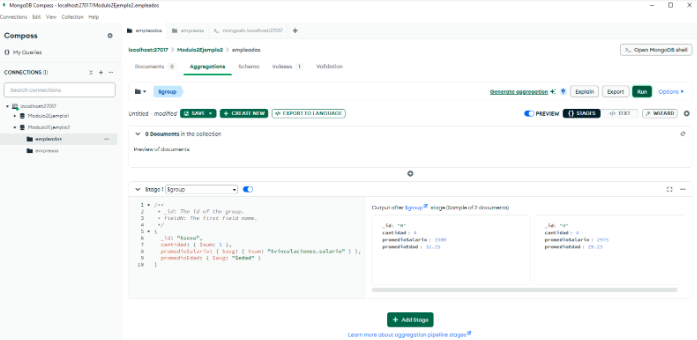

# Ejemplo práctico 2

Consultar cuántos empleados hay por sexo, cuál es el promedio de sus salarios y el de la edad para cada grupo. 

## _**Etapa 1: Agrupación de los documentos con $group**_ 

Agrupar los documentos de la colección empleados a través del campo sexo. 

Realizar los cálculos requeridos: 

- **`cantidad:`** Suma cada una de las instancias de los documentos empleados por grupo. promedioSalario: Calcula el promedio de los salarios mediante los especificados en las vinculaciones. 

- **`promedioEdad:`** Permite realizar el cálculo del promedio de las edades de los empleados. 

 

  _**Figura 38: Etapa 1 - Ejemplo Práctico 2**_ 

## _**Solución Óptima**_

En la siguiente figura se presenta una solución óptima que evita el reprocesar información al utilizar el operador _**$avg**_ dentro del operador _**$group**_. La solución planteada utiliza menos recursos de memoria, ya que permite realizar cálculos de manera separada (es decir, suma los valores y luego los divide para obtener los respectivos promedios). Este tipo de enfoque de solución es eficiente cuando se desean procesar grandes volúmenes de datos, ya que ayuda a reducir el procesamiento innecesario y mejorar la utilización de los recursos. Además, ofrece una solución clara, eficiente y fácil de entender, lo que contribuye tanto al rendimiento de la consulta como a la legibilidad del script. 

 

  _**Figura 39: Solución Óptima - Ejemplo Práctico 2**_ 

> 🔜 **Continúa a la [siguiente sección](/docs/09-Manejo-de-Indices/9.1-Manejo-de-Indices.md)**
