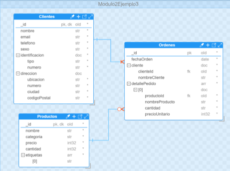
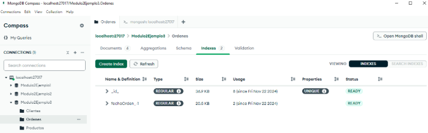

# Ejemplo práctico 1 

Un administrador de una tienda virtual necesita consultar la lista de ordenes realizadas por fecha, de la más reciente a las más antiguas. En este caso se podría crear un índice en el campo fechaOrden para mejorar el rendimiento de la consulta. 



**Figura 40: Esquema de Documentos Base de Datos Modulo2Ejemplo3**

Para mejorar el rendimiento de esta consulta, se creará el siguiente índice en la shell: 

```
db.Ordenes.createIndex({ fechaOrden: -1 }); 

```
Para comprobar su creación, se podrá seleccionar la colección Ordenes en MongoDB Compass y dar clic en la pestaña “**Indexes**” donde se observarán los diferentes índices con los que cuenta dicha colección. Es importante aclarar que los identificadores principales de cada documento de una colección tienen asociado un índice, para garantizar que sea único, por eso adicional al creado aparecerá el índice **_id_**. 



**Figura 41: Visualizar Índices Colección Ordenes en MongoDB Compass**

Para utilizar el índice creado, se deberá realizar una consulta y especificar que el ordenamiento de los resultados se debe realizar mediante el campo fechaOrden de forma descendente, que es como se definió: 


```
db.Ordenes.find().sort({ fechaOrden: -1 }) 

```

Una vez MongoDB procese la consulta no deberá realizar el ordenamiento de los documentos de forma manual. En su lugar, buscará el índice correspondiente al campo “**fechaOrden**” en un árbol B balanceado, en donde ya estarán ordenados. Mediante el índice se relacionarán los documentos y se devolverán ordenados sin necesidad de realizar un paso adicional, reduciendo el tiempo de ejecución de la consulta y el uso de recursos. Mediante el siguiente comando se podrá verificar si la consulta está haciendo uso del índice.  

```
db.Ordenes.find().sort({ fechaOrden: -1 }).explain("executionStats"); 

```

En el resultado de la ejecución de este comando, se podrá verificar si aparece **IXSCAN** con _fechaOrden: -1_ y que no se incluye una etapa **SORT**. Todo lo anterior indicará que la consulta utilizó el índice y no requirió ordenar los resultados de forma manual. 
