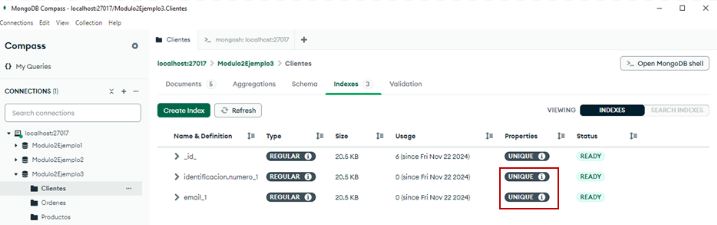
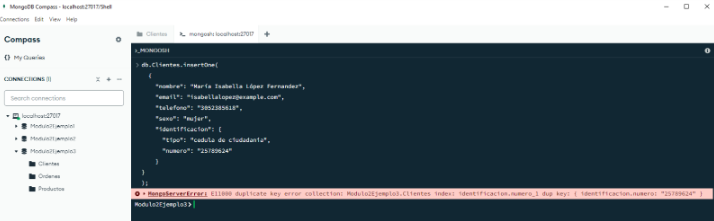

# Ejemplo práctico 2 

Un diseñador de una base de datos desea garantizar que campos como correo electrónico y número de identificación de la colección Clientes sean únicos e irrepetible. 

Para cumplir con este objetivo y garantizar de forma individual que cada uno de estos campos sean únicos, se podrán crear los índices de la siguiente forma: 

```
db.Clientes.createIndex({ "identificacion.numero": 1 }, { unique: true });

```  
```
db.Clientes.createIndex({ email: 1 }, { unique: true }); 

```
 
Ahora, se podrá comprobar la creación de los índices a través de la colección. En donde se puede visualizar que están los dos índices creados y que además tienen como propiedad “**UNIQUE**”, lo que indica que no pueden existir valores duplicados para estos campos.   



**Figura 42: Visualizar Índices Colección Clientes en MongoDB Compass**

En la siguiente figura se presenta un ejemplo, en el que se desea realizar la inserción de documento en la colección Clientes que contiene valores repetidos en los campos correo electrónico e identificación, los cuales ya han sido ingresados por un cliente existente. En la shell de MongoDB, se puede observar la respuesta del sistema, en donde se garantiza la integridad de los datos al impedir la inserción del documento, mediante el siguiente mensaje:  

_`“Modulo2Ejemplo3.Clientes index: identificacion.numero_1 dup key: { identificacion.numero: "25789624" }”.`_ 



> ### ⏭️**Prosigue al tema: [Índices Compuestos🗂️](../9.3-Índices-Compuestos/9.3-Indices-Compuestos.md)**
