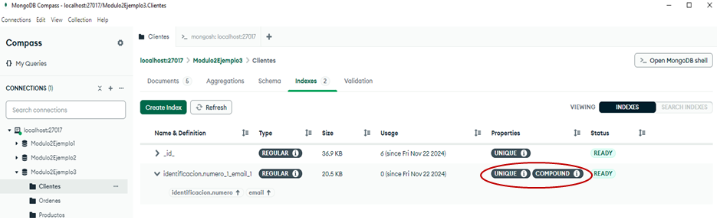

# Ejemplo práctico: 

Un diseñador de base de datos desea garantizar que los campos correo electrónico y número de identificación en la colección Clientes sean únicos e irrepetibles de forma combinada.  

Para lograr su realización se creará un índice compuesto mediante el siguiente comando: 

```
db.Clientes.createIndex( 

  { "identificacion.numero": 1, email: 1 },  // especificamos los campos asociados al índice 

  { unique: true }           // garantizamos la unicidad 

); 

```
 
Ahora, se podrá comprobar la creación del índice a través de la colección. En la siguiente figura se puede observar que el índice fue creado de forma correcta y que además indica que los campos asociados deben ser únicos mediante la propiedad “**UNIQUE**” y señala que es un índice compuesto a través de la propiedad **COMPOUND**. 



**Figura 43: Visualización Índices Únicos y Compuestos Colección Clientes**


## _**Ejemplos de comprobación:**_ 

Caso exitoso, combina un número de identificación diferente con un correo existente 

```
db.Clientes.insertOne( 

  { 

    "nombre": "María Isabella López Fernandez", 

    "email": "isabellalopez@example.com", 

    "telefono": "3022585719", 

    "sexo": "mujer", 

    "identificacion": { 

      "tipo": "cedula de ciudadania", 

      "numero": "12345678" 

    } 

} 

); 

```
 

Caso exitoso, combina un número de identificación existente con un correo nuevo 


```
db.Clientes.insertOne( 

  { 

    "nombre": "Camilo Hurtado", 

    "email": "churtado@example.com", 

    "telefono": "3001389610", 

    "sexo": "mujer", 

    "identificacion": { 

      "tipo": "pasaporte", 

      "numero": "AB123456" 

    } 

} 

); 

```
 

Caso fallido, combina número de identificación y correo ya existe 


```
db.Clientes.insertOne( 

  { 

    "nombre": "Sofia Blanco", 

    "email": "isabellalopez@example.com", 

    "telefono": "3001389610", 

    "sexo": "mujer", 

    "identificacion": { 

      "tipo": "cedula de ciudadania", 

      "numero": "12345678" 

    } 

} 

); 

```

_`Error: E11000 duplicate key error collection: Modulo2Ejemplo3.Clientes index: identificacion.numero_1_email_1 dup key: { identificacion.numero: "12345678", email: "isabellalopez@example.com" }`_

