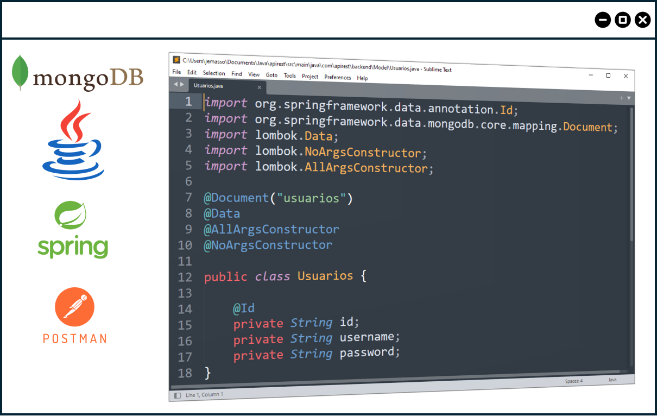

# Introducción

  

El desarrollo de un backend eficiente requiere buenas prácticas de desarrollo de software y herramientas que aseguren la calidad del producto. El uso de un framework robusto como Spring Boot simplifica y acelera el desarrollo de software, reduciendo la complejidad y las configuraciones manuales. Además, su combinación con una arquitectura de software como el Modelo Vista Controlador y Capas permite construir aplicaciones sólidas, escalables y alineadas con las tendencias actuales del desarrollo empresarial actual. 

Por otro lado, el uso de una base de datos como MongoDB, implementada a nivel local o en la nube, optimiza el funcionamiento de un backend para manejar los datos de manera flexible y eficiente, con una estructura fácil de mantener y que se adapta a las necesidades específicas de la aplicación y del negocio. La unión de todos estos componentes constituye una base sólida para desarrollar aplicaciones robustas, las cuales pueden ser testeadas para verificar el cumplimiento de los requisitos y reducir los riesgos en un entorno de producción.

> ### **Empieza con la configuración del [Entorno de programación 💻](/docs/13-Configuracion-Entorno-Programacion/13.1-Visual-Studio-Code.md)**
