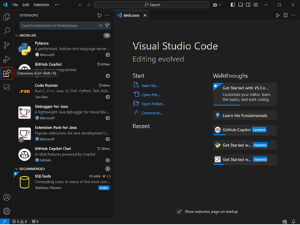
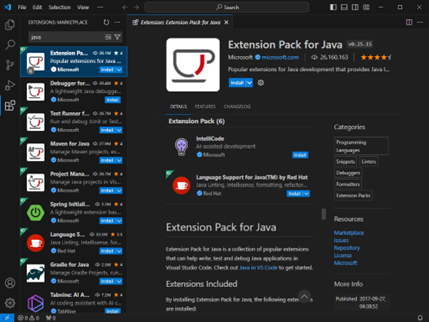
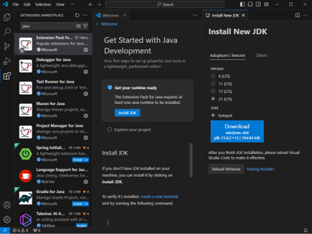
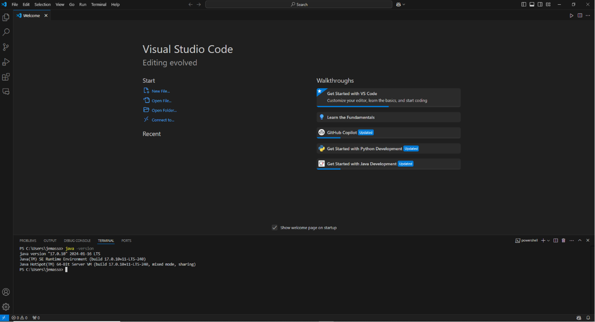
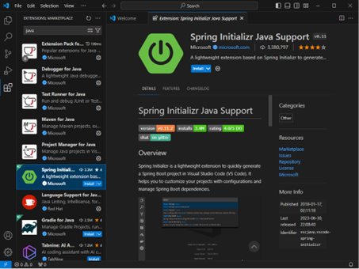
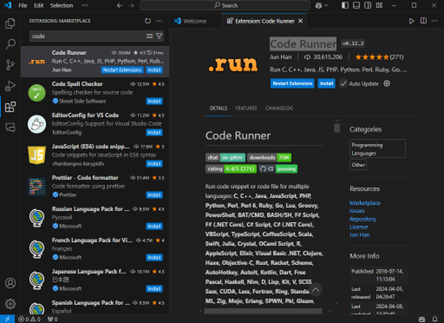

# Configuración del Entorno de Programación 

En el contexto del desarrollo de software configurar el entorno de programación está orientado a preparar y configurar todo el conjunto de herramientas y tecnologías necesarias para dar comienzo al proceso de desarrollo. Es decir, tener un ambiente de desarrollo ajustado y operativo que ayude a minimizar los riesgos técnicos que puedan afectar el proceso de desarrollo. Algunas de las herramientas y tecnologías claves para el desarrollo de un backend de una **`API`** _**(Application Programming Interface)**_ **`REST`** _**(Representational State Transfer)**_ basado en el lenguaje de programación Java haciendo uso del framework Spring Boot y la potencia de una base de datos como MongoDB son:

## Visual Studio Code (VS Code)

Es un editor de código abierto desarrollado por Microsoft, que puede ser instalado y ejecutado en el escritorio de sistemas operativos como Windows, MacOS y Linux ​[1], [2]​. En VS Code, es posible desarrollar una amplia variedad de aplicaciones de software utilizando diferentes lenguajes de programación, herramientas y depuradores adicionales que facilitan el flujo de trabajo en el ciclo de desarrollo de software. Esto se logra gracias a las diferentes extensiones desarrolladas por Microsoft, empresas de software y comunidades de código abierto, y que están disponibles en el [Marketplace](https://code.visualstudio.com/docs/editor/extension-marketplace) de VS Code.

En este sentido, se deberá instalar y configurar VS Code para el desarrollo en [Java <i class="fas fa-external-link-alt"></i>](https://code.visualstudio.com/docs/java/java-tutorial):

### Paso 1: Abrir la ventana del Marketplace en VS Code.

En la ventana principal de VS Code dar clic en el botón  

**Figura 1. Marketplace de Extensiones**

### Paso 2: Instalar Extension Pack for Java

Ir a la ventana de la Marketplace y buscar la extensión escribiendo el nombre completo “Extension Pack for Java” o la palabra “java”, como se presenta en la Figura 2. Seleccionar la extensión desarrollada por Microsoft y dar clic en instalar.

**Figura 2. Extension Pack for Java**

### Paso 3: Instalar Java Development Kit (JDK)

Si es la primera vez que se programa en Java en el equipo, VS Code sugerirá instalar una JDK por defecto. Por tanto, se deberá dar clic en instalar JDK (Ver Figura 3).

**Figura 3. Instalar Nueva JDK**

En caso contrario, VS Code detectará de forma automática la JDK que este instalada en el sistema. Para verificar la versión de JDK está instalada en el equipo, se podrá realizar los siguientes pasos:

**A.** Ir a la barra de menú de VS Code.

**B.** Dar clic en Terminal y selecciona New Terminal.

**C.** En la terminal, escribir el comando “java -version” (Ver Figura 4).

**Figura 4. Verificar JDK detectada por VS Code**

### Paso 4:  Instalar Spring Initializr Java Support

Seleccionar de la lista de extensiones generada en el Paso 2 la desarrollada por Microsoft y dar clic en instalar. Si no aparece en la lista, realiza la búsqueda en la Marketplace de extensiones mediante el nombre completo “Spring Initializr Java Support” o escribiendo “spring”.

**Figura 5. Spring Initializr Java Support**

### Paso 5:  Instalar Code Runner

La extensión Code Runner es opcional, pero el tenerla permitirá la ejecución del código de la aplicación de forma rápida. Por tanto, para su instalación se deberá buscarla en la Marketplace mediante el nombre completo “Code Runner” o escribiendo “code”. Seleccionar la desarrollada por Jun Han y dar clic en instalar (Ver Figura 6).

**Figura 6. Code Runner**
