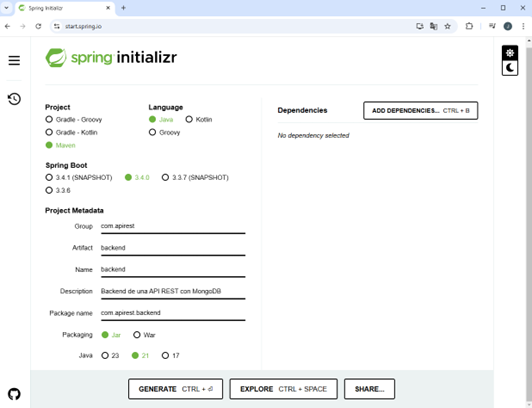
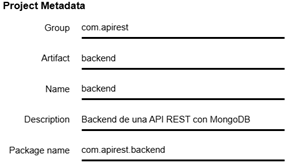
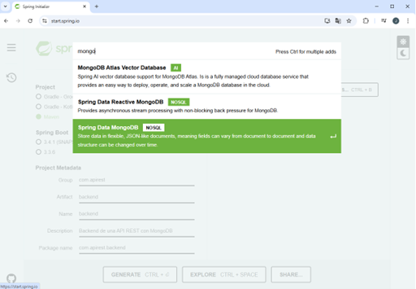

# Spring Boot

Spring Boot es uno de los frameworks más populares para el desarrollo de aplicaciones modernas mediante el lenguaje de programación Java. Este framework ofrece a los desarrolladores un sin número de herramientas que simplifican y aceleran el desarrollo de software al reducir de manera significa la configuración y escritura de código repetitivo, lo que permite a los desarrolladores centrarse en lógica del negocio.

Spring Boot es ideal para la creación aplicaciones modernas como APIs REST, microservicios, aplicaciones sin servidor, sistemas basados en eventos, etc. Este framework incluye un servidor embebido como Tomcat, el cual facilita la ejecución y despliegue de aplicaciones web a través de solicitudes HTTP mediante el puerto 8080. Adicionalmente, permite la gestión eficiente de dependencias para soportar el desarrollo de las aplicaciones y utilizar el patrón de diseño Modelo-Vista-Controlador (MVC) para simplificar su configuración y despliegue.

## Generar un Proyecto con Spring Initializr

### Paso 1: Abrir el sitio web Spring Initializr  para crear un proyecto Spring Boot

Se utilizará este sitio ya que nos ofrece una plantilla base que permite realizar una configuración personalizada del proyecto, la cual permite cumplir con las necesidades de la creación de una aplicación. En este caso será una API REST.

**Figura 7. Plantilla base de Spring Initializr**

### Paso 2: Configurar la gestión de las dependencias y la estructura de construcción del proyecto

Seleccionar o dejar por defecto la herramienta Maven. Esta herramienta permite gestionar de forma automática la construcción del proyecto. Garantizando que el proceso de construcción sea repetible y consistente. Una vez se cree el proyecto se generará el archivo “pom.xml” (Project Object Model), el cuál contendrá todas las dependencias y configuraciones que se hayan realizado al proyecto.

### Paso 3: Diligenciar la metadata del proyecto

Especificar el grupo o dominio bajo el cual se agruparán todos los componentes de la aplicación. Establecer el identificador del proyecto a través del “Artifact”. Este elemento servirá para nombrar el archivo de empaquetamiento que se generará al compilar la aplicación. Brindar el nombre del proyecto, usualmente es el mismo del “Artifact”. Brindar una descripción breve del proyecto que permitirá identificar que tipo de desarrollo se desea realizar. Finalmente, especificar el nombre del paquete raíz que será donde se coloque el código del proyecto.

**Figura 8. Metadata del Proyecto**

### Paso 4. Especificar el empaquetamiento y la JDK

Este paso es crucial ya que se especificará como se construirá y ejecutará el proyecto. En este caso se utilizará el “jar”, ya que se creará una aplicación autónoma que utilizará el servidor embebido de spring en este caso Tomcat. Seleccionar la JDK según el entorno de desarrollo (equipo de desarrollo) y/o equipo de ejecución de la aplicación (servidor o máquina de producción).

### Paso 5: Agregar dependencias

Seleccionar las dependencias o componentes necesarios para la creación del backend de una API REST. En este caso se emplearán las siguientes dependencias:

**A.** Spring Boot DevTools: Esta dependencia proporciona herramientas y funcionalidades que mejoran la productividad y eficiencia del desarrollador durante el desarrollo de la aplicación.

**B.** Spring Web: Proporciona los elementos necesarios para el desarrollo de aplicaciones web, incluyendo soporte para la gestión de solicitudes HTTP y la creación de controladores REST.

**C.** Spring Data MongoDB: Proporciona una capa de abstracción sobre el controlador de conexión MongoDB Java Driver. Esta capa simplifica las operaciones y facilita el desarrollo de aplicaciones Spring al ofrecer una interfaz coherente y fácil de usar para interactuar con la base de datos MongoDB.

**D.** Lombok: Este proyecto tiene como finalidad reducir la escritura del código, permitiendo generar de forma automática la creación de métodos comunes en clases Java, como getters, setters y constructores.

> **Nota:** Para adicionar las dependencias se deberá dar clic en el botón “ADD DEPENDENCIES… CTRL +B”. En la ventana emergente, se podrá colocar el nombre completo de la dependencia o un nombre corto. Por ejemplo, para agregar la dependencia Spring Data MongoDB, escribir mongo en el cuadro de búsqueda, seleccionar Spring Data MongoDB y luego dar clic sobre ella para que se integre a la configuración. (Ver Figura 9)

**Figura 9. Adicionar Dependencias**

### Paso 6: Generar el proyecto

Una vez se termine de diligenciar la plantilla base del proyecto en spring, se deberá dar clic en el botón *“GENERATE CTRL + ⤶ ”*. El sitio generará un archivo *“.zip”* con el nombre brindado al proyecto *“backend.zip”*. Esta carpeta se deberá descomprimir y guardar en el área de trabajo que se emplee para los proyectos personales. En la Figura 10, se puede observar la configuración definitiva realizada para el proyecto que se desarrollará en esta guía.

**Figura 10. Configuración Final del Proyecto**

## Continúa con la instalación de [Postman :astronaut: :arrow_right:](13.3-Postman.md)
