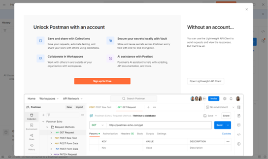
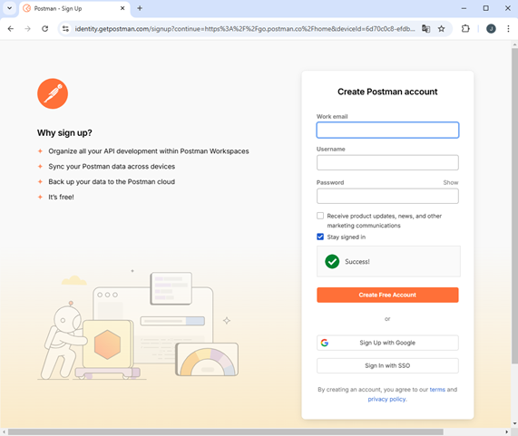
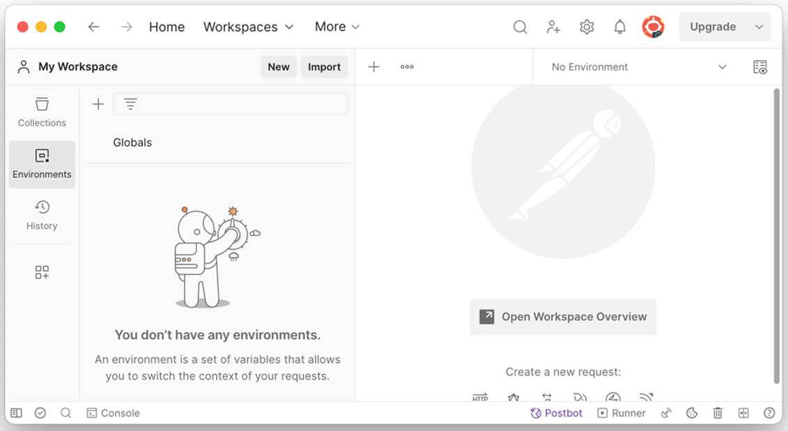

# Postman

Postman es una herramienta empleada por equipos de aseguramiento de calidad (QA, en sus siglas en inglés) y desarrolladores software, con el fin de interactuar, probar y documentar las APIs de manera eficiente y colaborativa.

## Paso 1: Descargar e instalar [Postman <i class="fas fa-external-link-alt"></i>](https://www.postman.com/downloads/)

Ir al sitio oficial de y descargar la APP de Postman según el sistema operativo (Windows, macOS o Linux). Una vez descargado seguir las instrucciones del programa para su instalación.

## Paso 2: Crear una [cuenta en Postman <i class="fas fa-external-link-alt"></i>](https://identity.getpostman.com/signup?continue=https%3A%2F%2Fgo.postman.co%2Fbuild&_uuid=26ac2c80-d30a-4ecd-a3f3-c3bca2a1beca&authFlowId=77b82545-0a26-4c56-a569-4214ba821d90)

Una vez instalado en el equipo se deberá crear una cuenta en Postman. Para hacerlo se pueden seguir dos caminos: abrir la aplicación _(Ver Figura 11)_ o dirigiéndose a la página oficial de Postman _(Ver Figura 12)_ en donde se deberá dar clic en *"Sign Up"*, diligenciar el formulario y seguir el proceso indicado.

**Figura 11. Inicio de Postman en el Equipo**

**Figura 12. Crear Cuenta de Postman Vía Web**

## Paso 3: Iniciar Postman

Una vez este creada la cuenta, se deberá autorizar a la API para utilizar a Postman en el equipo. De esta manera quedará lista para realizar cualquier tipo de interacción con una aplicación.

**Figura 13: Entorno Principal de Postman**

## Sigue con el tema: [API REST y Diseño Arquitectónico :bricks: :gear: :arrow_right:](/docs/14-API-REST-Diseño-Arquitectonico/14.1-API-REST-y-Diseño-Arquitectonico.md)
