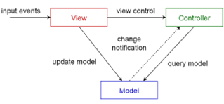
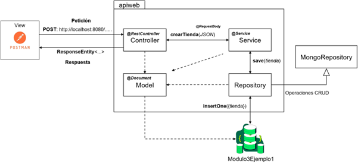

# API REST y Diseño Arquitectónico

Ahora es el momento de comprender de manera general los fundamentos básicos sobre lo que es una API REST y la utilidad de los patrones de diseño arquitectónico para la creación de aplicaciones software.

## API REST

Una Interfaz de Programación de Aplicaciones (en sus siglas en inglés API) es un conjunto de definiciones, protocolos y herramientas diseñadas para integrar y comunicar diferentes aplicaciones o sistemas. Una API es un mediador que permite conectar a un usuario con los diferentes recursos o servicios informáticos que ofrece una aplicación (por ejemplo, web, móvil, etc.). 

Cuando una API adopta un estilo arquitectónico como REST (Representational State Transfer) incorpora principios que garantizan una comunicación segura, confiable y eficiente basada en el protocolo HTTP [3], [4]. REST define cómo debe operar una API, permitiendo el intercambio de información en formatos como JSON o XML. Además, soporta las operaciones CRUD mediante solicitudes HTTP, a través de verbos estándar como son:

* **GET:** Permite la recuperación de datos.
* **POST:** Se utiliza para la creación de datos.
* **PUT:** Facilita la actualización de datos.
* **PATCH:** Permite la actualización parcial de datos.
* **DELETE:** Permite eliminar datos de forma definitiva.

## Diseño Arquitectónico

El diseño arquitectónico a nivel del desarrollo de software hace referencia al uso de patrones arquitectónicos que permiten brindar una estructura general y reutilizable para abordar la implementación de una aplicación. Como se mencionó anteriormente, Spring Boot hace uso del patrón MVC para soportar el desarrollo de aplicaciones web. Este patrón permite gestionar la interacción entre los usuarios y la aplicación, mediante una interfaz grafica de usuario. En este sentido los principales componentes del MVC son:

* **Modelo (Model):** Este componente representa la lógica datos y del negocio. Es responsable de procesar las solicitudes y mantener el estado de la aplicación.

* **Vista (View):** Este componente se encarga de proporcionar la interfaz de usuario para interactuar con la aplicación y mostrar la información al usuario.

* **Controlador (Controller):** Este componente proporciona toda la lógica necesaria para recibir, validar, direccionar las solicitudes HTTP, y gestionar las respuestas hacia la vista. Es decir, es el intermediario entre la vista y el modelo.

**Figura 14. [Patrón MVC](https://bit.ly/46CPowR)**

En el desarrollo de aplicaciones web con Spring Boot, es común integrar los patrones MVC y Capas (Layered) para garantizar una arquitectura sólida, escalable, modular y mantenible. El patrón MVC se encarga de cumplir con las responsabilidades de los componentes externos (interacción entre el usuario y la aplicación), mientras que el patrón Capas se encargará de estructurar y organizar la lógica interna, es decir, la gestión de la lógica del negocio, el acceso a datos, la manipulación y transferencia de datos.

**Figura 15. Flujo de Trabajo de la Aplicación**

En la Figura 15, se puede observar el flujo de trabajo básico, en donde se pueden apreciar los principales componentes del backend y sus respectivas responsabilidades. A continuación, se describe de forma general el flujo de interacción de los diferentes componentes:

* El usuario realiza una petición HTTP *(ej. POST: http://localhost:8080/UAO/apirest/Tiendas/crearTienda)* desde Postman (View).

* El Controller recibe la solicitud, valida los datos y envía a la capa Service.

* El Service ejecuta la lógica de negocio correspondiente y solicita las acciones necesarias a la capa Repository.

* El Repository accede a la base de datos haciendo uso de las funcionalidades a través de MongoRepository y los retorna a la capa Service.

* El Service procesa los datos recibidos y los retorna a la capa Controller.

* Finalmente, el Controller envía una respuesta con los datos al usuario en formato JSON para que sean presentados al usuario en Postman.

Finalmente, la integración de los patrones MVC y Capas, facilita la extensibilidad y el mantenimiento de las aplicaciones, ya que promueve una separación clara de responsabilidades y asegura que cada componente tenga un propósito bien definido para su correcto funcionamiento.
