# Desarrollar el Backend de una API REST

En este ejercicio práctico, se desarrollará el backend de una API REST utilizando Spring Boot y MongoDB. La arquitectura de software adoptada para estructurar y organizar el código integrará los patrones MVC y Capas, lo que garantizará una solución escalable, modular y mantenible. A continuación, se detallan los pasos a seguir para llevar a cabo el desarrollo del backend y pruebas para validar su correcto funcionamiento.

## Paso 1: Crear la base de datos en MongoDB Compass

Modelar en Hackolade la base de datos que se presenta en la *Figura 16*. Se deberá garantizar que las colecciones tengan como nivel de validación el moderado, se controlen el manejo de error y permitan la adición futura de propiedades.

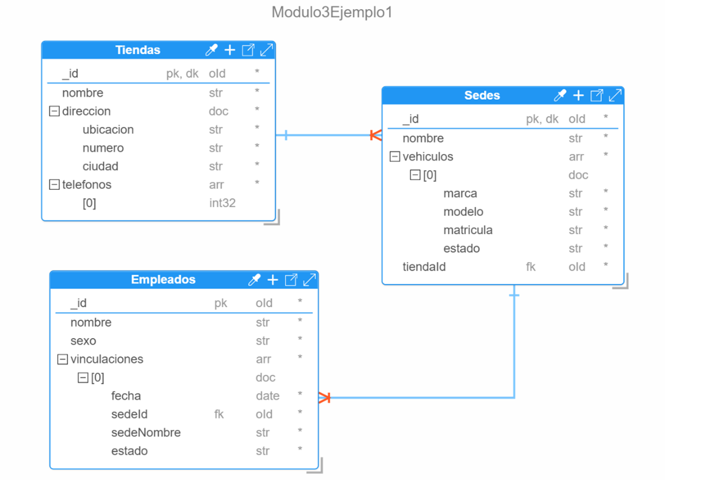

**Figura 16. Base de Datos Modulo3Ejemplo1**

> **Nota:** _El estado para los vehículos de la sede son activo, inactivo, baja_

## Paso 2: Crear el proyecto de Spring Boot

Para crear el proyecto, utilizaremos la herramienta web *“Spring Initializr”* siguiendo la estructura definida en la *Figura 10*.

## Paso 3: Abrir el proyecto de Spring en VS Code

Abrir VS Code y dar clic en el icono    de la ventana de bienvenida. Ir a la barra de menú y seleccionar *“File”* y luego *“Open Folder…”*. Paso siguiente, buscar la carpeta que contiene el proyecto generado en la web Spring Initializr, esta deberá estar descomprimida. Una vez abierto el proyecto aparecerá una ventana emergente y se deberá especificar que se confía en la procedencia del proyecto y se deberá dar clic en el en el botón *“Yes, I trust the authors”* *(Ver Figura 17)*.

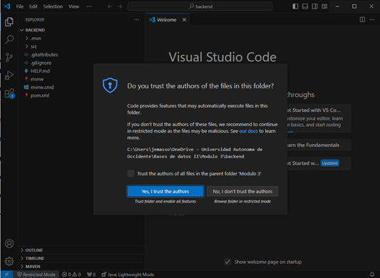

**Figura 17. Abrir el Proyecto Backend en VS Code**

## Paso 4: Crear las capas del proyecto backend con sus respectivos recursos

Con el fin de seguir la estructura de la arquitectura software a través de la integración de los patrones MVC y Capas, se creará cada una de las carpetas que representarán las capas del proyecto backend, cada una con responsabilidades específicas. Las capas que se implementarán son:

* **Modelo (Model):** Contendrá las clases que mapearan las colecciones de nuestra base de datos en MongoDB. 

* **Respositorio (Repository):** Permitirá gestionar las interacciones con la base de datos. Proveerá las funcionalidades necesarias para llevar a cabo las operaciones CRUD y garantizará la persistencia de los datos mediante el uso de interfaces y consultas específicas mediante la creación de un pipeline de agregaciones.

* **Servicio (Service):** Encapsulará toda la lógica del negocio, a través de la declaración e implementación de las funcionalidades claves de la aplicación. Interactuará con la capa Repositorio para cumplir con su funcionamiento.

* **Controlador (Controller):** Se encargará de dar manejo a las solicitudes HTTP entrantes desde la capa Vista. Además, interactuarán con la capa de Servicio para aplicar la lógica de negocio, y generarán las respuestas adecuadas.

* **DTO:** Facilitará la transferencia de datos entre capas. Su propósito principal en el backend es soportar la creación de consultas personalizadas y estructurar datos que no puedan ser gestionados por la capa Modelo.

* **Vista (View):** Debido a que solo se desarrollará el backend de la API REST, se utilizará la herramienta Postman para soportar esta capa. Postman permitirá realizar la interacción con el backend mediante solicitudes HTTP y servirá como medio para visualización de los resultados.

### Paso 4.1: Crear la capa “Model”

Para su creación, se deberá dar clic derecho en la ruta del proyecto “java/com/apirest/backend”, seleccionar la opción *“New Folder…”* *(Ver Figura 18)*, brindar el nombre Model y presionar enter para que se cree.

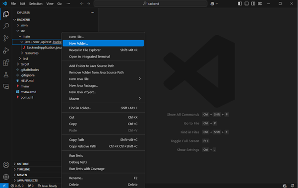

Una vez creada la carpeta Model, se podrá crear la Clase **`TiendasModel.java`** la cual mapeará la colección Tiendas de la base de datos. Para crear esta clase se deberá dar clic derecho en la carpeta Model y seleccionar la opción *“New File…” (Ver Figura 19)*, brindar el nombre **`TiendasModel.java`** y presionar enter para que se cree.

> **Nota:** _Es importante brindar la extensión “.java” para garantizar que se creará un archivo de Java. Sino se creará un archivo de texto por defecto._

Una vez creada la clase **`TiendasModel.java`**, se deberán definir los atributos que representarán los datos de la colección en MongoDB, estos son: *_id, nombre, dirección (con los campos ubicación, número y ciudad) y teléfonos.*

**Descripción general de los atributos:**

* **id:** Identificador principal de la colección, marcado con la anotación @Id.

* **dirección:** Documento embebido. Para su manejo se debe crear una clase independiente nombrada como **`DireccionTienda`** que contendrá los atributos: *ubicación, número y ciudad*. En la clase **`TiendasModel`**, se deberá crear entonces un objeto dirección el atributo de tipo **`DireccionTienda`** para cumplir con el documento embebido.

* **teléfonos:** Es un atributo multivaluado. Para su se representación, se empleará una lista **`(List<Integer>)`** que permitirá almacenar múltiples números de teléfono para una tienda.

La implementación final de la clase **`TiendasModel`** se puede observar en la Figura 21, mientras que el diseño de la clase **`Dirección`** se presenta en la Figura 20.

**Descripción de las anotaciones utilizadas en las clases:**

**Anotaciones de Spring Boot**

*	**`@Document:`** Permite especificar que la clase mapeará una colección de una base de datos en MongoDB.

*	**`@Id`**: Esta anotación nos permite marcar que un atributo se comportará como identificador principal.

**Anotaciones de Lombok**
Lombok simplifica la creación de clases eliminando la necesidad de escribir código repetitivo (getters, setters, constructores, etc). En este caso, se utilizan:

*	**`@Data`**: Permite que se genere de forma automática los getters y setters de una clase, entre otros.
*	**`@AllArgsConstructor`**: Crear un constructor con todos los atributos de la clase como parámetros de entrada.
*	**`@NoArgsConstructor`**: Crear un constructor por defecto, es decir sin parámetros.

Estas anotaciones son esenciales para incluir funcionalidades proporcionadas por las dependencias del proyecto y el framework Spring Boot, simplificando la implementación y mejorando la legibilidad del código.

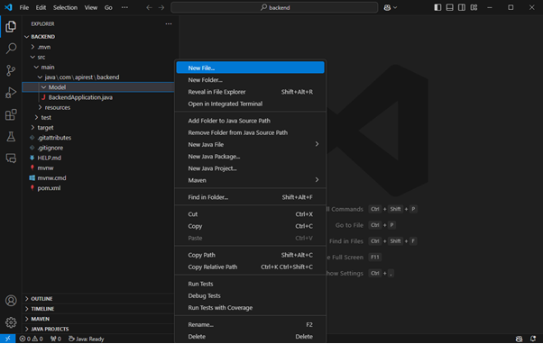

**Figura 19. Crear un Archivo Java en VS Code**

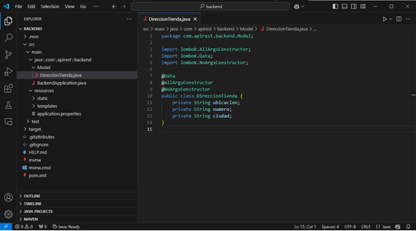

**Figura 20. Clase DireccionTienda**

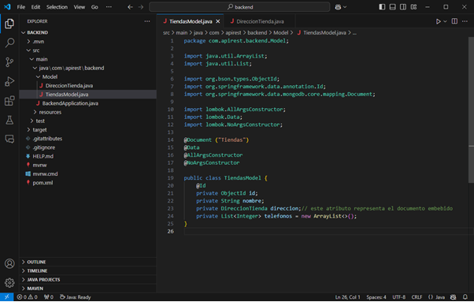

### Paso 4.2: Crear la capa “Repository”

Crear la carpeta _“Repository”_ en la ruta del proyecto “java/com/apirest/backend”, y dentro de esta crear la interfaz **`ITiendasRepository.java`**, que permitirá gestionar las interacciones con la base de datos. Es importante que al crear el nuevo archivo especifiquemos que el tipo de estereotipo que representará es una _“interface” (Ver Figura 22)._

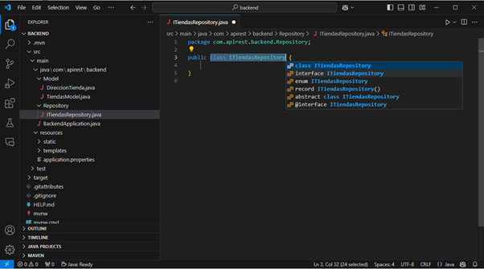

**Figura 22. Crear una Interfaz**

La interfaz **`ITiendasRepository`** deberá extender de **`MongoRepository`**, para heredar todas las operaciones que se pueden hacer sobre la base de datos y que están predefinidas en Spring Boot.  Por tanto, se deberá especificar los siguientes componentes en el **`MongoRepository <“Nombre de la clase que mapea la colección” , “nombre de la clase que representa el tipo de dato del identificador principal de la colección”>`** _(Ver Figura 23)._

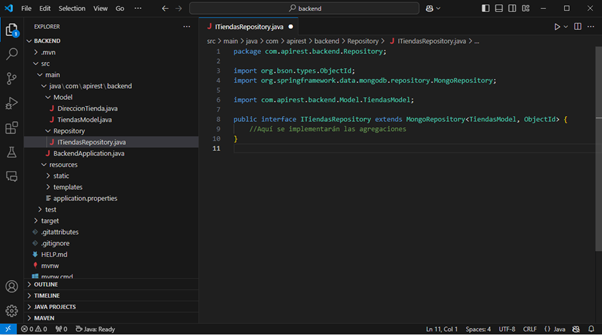

**Figura 23. Interfaz ITiendasRepository**

### Paso 4.3: Crear la capa “Service”

En los proyectos de Spring Boot, una buena práctica de programación es desacoplar las responsabilidades para mejorar la escalabilidad, mantenibilidad de código y hacer el código más limpio, etc. Para cumplir con esta buena práctica de desarrollo se creará la carpeta _“Service”_ en la ruta del proyecto “java/com/apirest/backend”, y dentro de esta los siguientes componentes:

* La interfaz **`ITiendasService`**, definirá el contrato de las funcionalidades que ofrecerá el servicio relacionado con la clase **`TiendasModel`**. Uno de sus principales propósitos es establecer el puente comunicación con el controlador a través del uso de inyecciones de dependencias.

* La clase **`TiendasServiceImp`**, se encargada de implementar todas las funcionalidades definidas en la interfaz **`ITiendasService`**. Para identificar en el proyecto que esta clase representa un componente de servicio, se debe utilizar la anotación **`“@Service”`**. Además, se utilizará la anotación **`“@Autowired”`** para realizar la inyección de dependencias con **`ITiendasRepository`**, lo que permitirá acceder a las operaciones CRUD y otras interacciones necesarias con la base de datos.

La implementación de estos componentes se detalla en las Figuras 24 y 25.

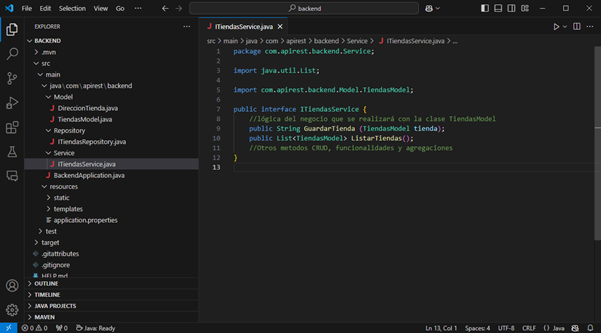

**Figura 24. Interfaz ITiendasService**

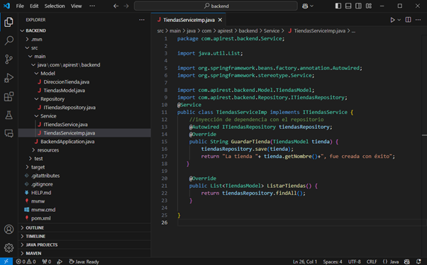

**Figura 25. Clase TiendasServiceImp**

> **Nota:** _En el contexto de la programación, una "dependencia" se refiere a un objeto o componente que otro objeto necesita para llevar a cabo su trabajo. Una correcta gestión de las dependencias permitirá garantizar la modularidad y mantenimiento del código._

### Paso 4.4: Crear la capa “Controller”

Crear la carpeta _“Controller”_ en la ruta del proyecto “java/com/apirest/backend”, y dentro de esta crear la clase **`TiendasController`**. Para identificar que esta clase representa un controlador en el proyecto, se debe utilizar la anotación **`@RestController`**. Esta anotación permite exponer servicios web en el desarrollo de aplicaciones RESTful, facilitando la interacción con el backend a través de formatos como JSON. 

Se deberá utilizar la anotación **`“@RequestMapping”`** para especificar la URL (Endpoint) del controlador, que definirá el punto de acceso para interactuar con las funcionalidades definidas para la clase **`TiendasModel`**. Por ejemplo, “/UAO/apirest/Tiendas”. 

Dentro de la clase **`TiendasController`** se implementarán los métodos que permitirán gestionar las solicitudes HTTP entrantes. En este sentido se deberá realizar una inyección de dependencias con la interfaz **`ITiendasService`** para generar la comunicación haciendo uso de la anotación **`@Autowired`**, lo que permitirá establecer la comunicación con la capa de servicio.

Además, se implementarán los siguientes métodos:

* Crear tienda que estará asociado a la anotación **`@PostMapping`** y permitirá gestionará las solicitudes para crear nuevos documentos en la base de datos.

* Listar tiendas que estará asociado a la anotación **`@GetMapping`** y permitirá recuperar todos los documentos de la colección Tiendas de la base de datos.

Ambas anotaciones, incluirán una subruta específica que al combinarlas con la URL del Endpoint conformarán las rutas finales de los servicios desarrollados. La implementación completa de este componente se puede observar en la Figura 25.

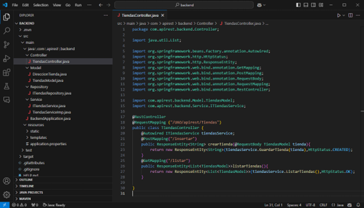

**Figura 25. Clase TiendasController**

## Paso 5: Configurar la Conexión del Proyecto con la Base de Datos

Para establecer la conexión con MongoDB es necesario configurar el archivo **`application.properties`**. Este archivo se encuentra ubicado en la carpeta *“resources”*, como se puede observar en la Figura 26.

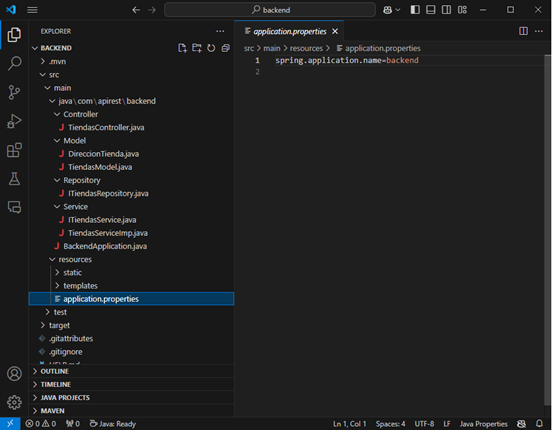

**Figura 26. Archivo application.properties**

En el archivo “application.properties”, se deberán definir los siguientes parámetros de conexión:

* **Host:** Dirección del servidor donde está alojada la base de datos MongoDB.

* **Puerto:** Número del puerto utilizado para establecer la conexión con MongoDB.

* **Nombre de la base de datos:** Nombre exacto de la base de datos que se usará en el proyecto.

La configuración completa de este archivo se muestra en la *Figura 27*. Esta configuración es fundamental para que el proyecto Spring Boot pueda interactuar correctamente con la base de datos.

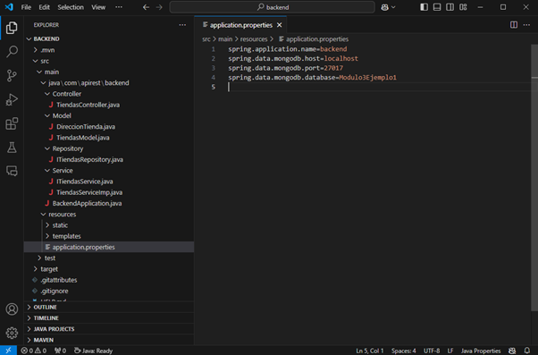

**Figura 27. Configuración de la Conexión del Proyecto con MongoDB**

## Paso 6: Ejecutar el Proyecto.

Para iniciar la ejecución del backend, primero se deberá localizar la clase que contiene el método principal del proyecto. Esta clase se encuentra en la ruta java/com/apirest/backend y su nombre corresponde al nombre del proyecto seguido de la palabra Application.

Una vez localizada, haga clic en la opción Run para ejecutar el programa principal. Si el proyecto ha sido configurado correctamente, al final de la consola deberá aparecer un mensaje similar a: 
**`“Started BackendApplication in 3.299 seconds (process running for 3.775)”`**

Este mensaje indicará que el backend se ha iniciado correctamente y está en ejecución. En la *Figura 28* se puede observar el resultado de la ejecución del programa principal del backend.

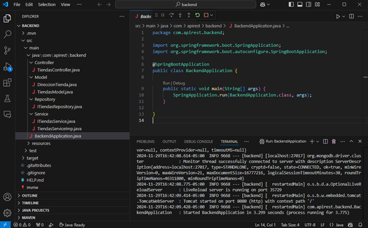

**Figura 28. Ejecución del Programa Principal del Backend**

## Paso 7: Pruebas funcionales al Backend

Para realizar las pruebas a las funcionalidades implementadas en el backend, se deberá abrir Postman y dar clic en el icono “+” que hace referencia a *“Create new Collection”* y dar el nombre de Tiendas. Luego se deberá crear una petición HTTP para poder agregar una tienda a la base de datos. Por tanto, dar clic en los “…” que hay junto al nombre de la colección y en el menú alternativo dar clic en *“Add request”*, como se observa en la *Figura 29*.

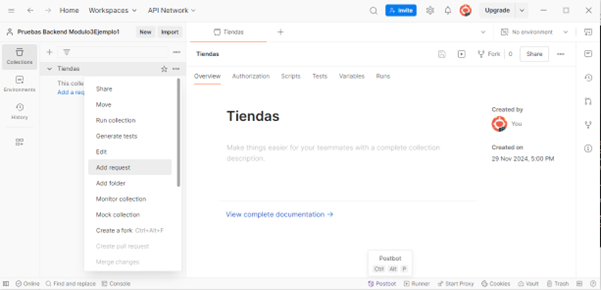

**Figura 29. Postman – Adicionar una Petición HTTP**

Una vez se adicionada la petición o solicitud HTTP se abrirá una nueva ventana *(Ver Figura 30)* donde se deberá especificar el método, formato y el cuerpo.

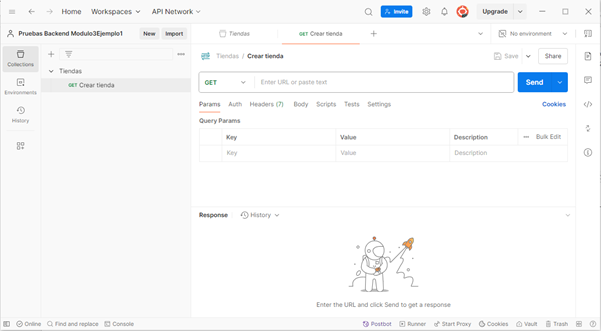

**Figura 30. Postman – Ventana de la petición**

Ahora, se deberá especificar el método de la petición HTTP que al estar asociada al método crear tiendas que está definido en el controlador, deberá ser POST. Se deberá fijar la URL asociada a esta petición la cual deberá ser “http://localhost:8080/UAO/apirest/Tiendas/insertar”. Se establece el formato, para esto, se deberá ir a *“Body”*, escoger *“raw”* y en *“text”* especificar que el formato es *“JSON”*. En el área de trabajo se deberá detallar el documento JSON con la información de la tienda. Una vez creado el documento JSON, dar clic en el botón *“Send”* para realizar el envío de la petición. Si la petición es correcta se deberá mostrar el mensaje *“La tienda Tienda TecnoSoftware, fue creada con éxito”* y el código *“201 Created” (Ver Figura 31).*

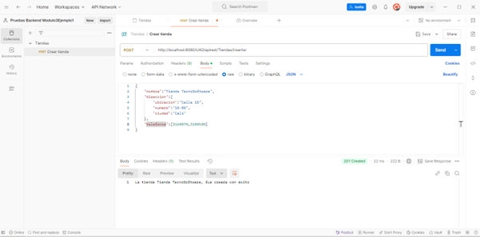

**Figura 31. Postman – Petición Crear Tienda Completa**

Finalmente, para listar todas las tiendas que se encuentran registradas en la base de datos, se deberá crear una petición GET que estará asociada la siguiente URL que se configuro en controlador “http://localhost:8080/UAO/apirest/Tiendas/listar”. El resultado de esta petición se puede observar en la *Figura 32*. Si la petición es correcta se retornará un arreglo de documentos JSON con las tiendas creadas y el código HTML _“200 OK”_.

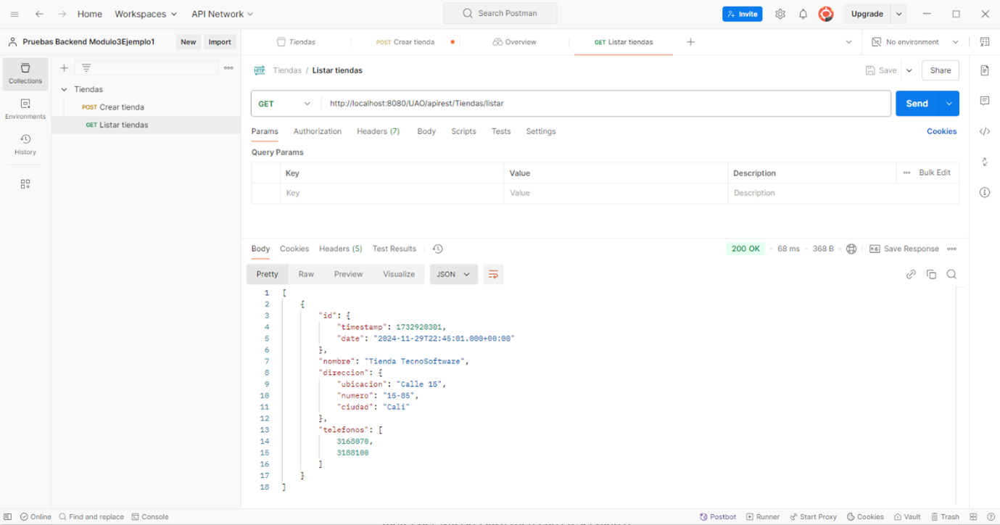

**Figura 32. Postman – Envío de la Petición Listar Tiendas**

En la figura 32, se puede observar que el id del documento no se está mostrando como un ObjectId sino como una marca de tiempo (timestamp). Si se desea mostrar el valor real del ObjetId en hexadecimal que fue asignado por MongoDB, se deberá agregar el siguiente método en la clase **`TiendasModel`**.

```
@JsonProperty("id")
    public String getIdAsString() {
        return id != null ? id.toHexString() : null;
    }
```

**Explicación:** La anotación **`@JsonProperty`** se utiliza para especificar el nombre del campo JSON que se desea mapear desde un atributo en la clase Java **`TiendasModel`** para brindar la respuesta. El método **`getIdAsString()`** permite convertir el valor del ObjectId (formato hexadecimal) del id a String haciendo uso del método **`toHexString()`**. Este método permitirá que el id se muestre como una cadena texto que sea legible y útil al serializar el objeto en JSON. En la *Figura 33*, se muestra la implementación de este método, y en la *Figura 34* se ilustra su funcionamiento durante una consulta.

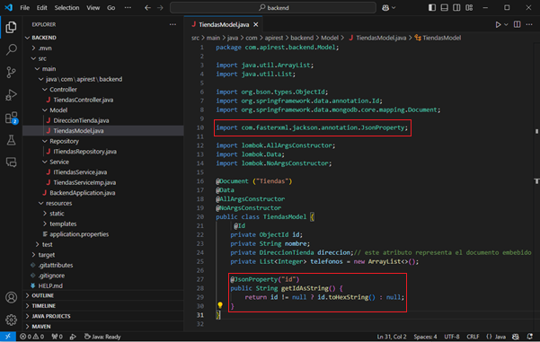

**Figura 33. Actualización de la Clase TiendasModel**

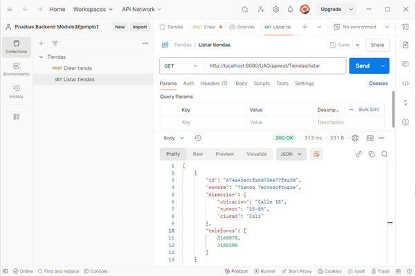

**Figura 34. Postman – Envío 2 de la Petición Listar Tiendas**

## Paso 8: Otras operaciones CRUD y consulta personalizada

Ahora se implementarán las funcionalidades de buscar una tienda por id, actualizar y eliminar una tienda. Adicionalmente, se implementará la consulta listar todas las tiendas pertenecientes a una ciudad.

### Paso 8.1: Crear la capa “Exception”.

Esta capa se encargará de centralizar y organizar el manejo de error en la aplicación mediante excepciones personalizadas que representen errores específicos, lo que permitirá separar el manejo del error de la lógica del negocio para hacer el código más limpio. En este sentido, esta capa contendrá las siguientes clases:

* **RecursoNoEncontradoException:** Esta clase representa una excepción personalizada que permite lanzar un error al no encontrar un recurso específico en la aplicación. Por ejemplo, al realizar una búsqueda por id. La implementación de esta clase se presenta en la *Figura 35*.

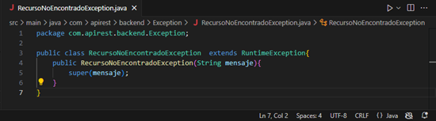

**Figura 35. Clase RecursoNoEncontradoException**

* **GlobalExceptionHandler:** Esta clase centraliza la capturara y gestión excepciones de la aplicación, permitiendo formatear las salidas de los errores para que sean más claras para los clientes. Es decir, se mostrará únicamente el mensaje de error personalizado que fuer asociado a una funcionalidad en la aplicación y el código HTML correspondiente su implementación se puede apreciar en la *Figura 36*.

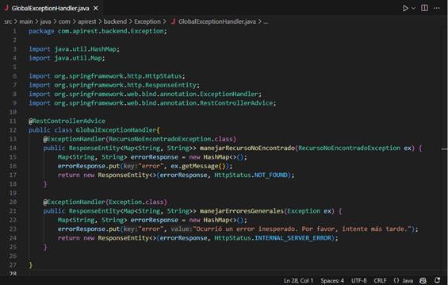

**Figura 35. Clase GlobalExceptionHandler**

### Paso 8.2: Crear la capa “DTO”. 

Esta capa se encargará de ayudar a mejorar la estructura y la eficiencia de la aplicación. Esta capa contendrá la clase **`TiendaDTO`**, la cual transformará y formateará los datos que se mostrarán como resultado de una consulta. Esto con el fin de proteger la estructura interna de la base de datos y proporcionar flexibilidad a la aplicación para presentar los datos de forma adecuada. En este sentido, la clase **`TiendaDTO`** se implementó específicamente para mostrar los valores necesarios que proyectará la consulta *“listar todas las tiendas pertenecientes a una ciudad”*, ya que la clase **`TiendasModel`** no contiene la misma estructura de los campos que proyecta la consulta.

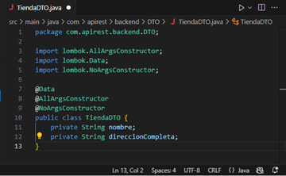

**Figura 36. Clase TiendaDTO**

> **Nota:** Si las consultas proyectan un conjunto de campos que son diferente al de la estructura interna de una colección, se deberá crear un DTO para mapear y presentar los datos de forma correcta.

### Paso 8.3: Actualizar la Interfaz ITiendasRepository

Ahora se deberá actualizar la interfaz **`ITiendasRepository`** para definir el pipeline para la consulta requerida utilizando la anotación **`@Aggregation`**. Además, se tendrá que definir el método **`buscarTiendasPorCiudad`** para poder capturar los valores que arroja la consulta ejecutada en MongoDB. La implementación de esta consulta se puede observar en la *Figura 37*.

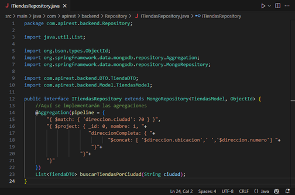

> **Nota:** El “?0” en la etapa $match hace referencia al primer parámetro del método **`buscarTiendasPorCiudad`**, el cual tomará el valor una vez se realice el llamado a la consulta.

### Paso 8.4: Actualizar el servicio

En este paso, se deberá actualizar la lógica del negocio a través de la implementación de los siguientes métodos:

* Buscar una tienda por su identificador (id).

* Actualizar los datos de una tienda existente.

* Eliminar una tienda específica.

* Listar todas las tiendas ubicadas en una ciudad determinada.

En la *Figura 38* se presenta la actualización a la interfaz **`ITiendasService`**, mientras que la implementación de la lógica del negocio en la clase **`TiendasServiceImp`** puede ser observada en la *Figura 39*.

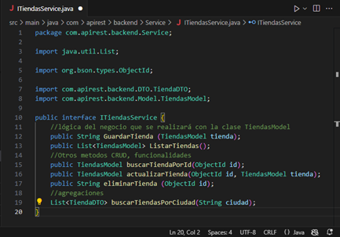

**Figura 38. Actualización ITiendasService**


**Figura 38. Actualización TiendasServiceImp**

### Paso 8.5: Actualizar el controlador TiendasController

En este paso, se deberá actualizar el controlador **`TiendasController`** para que los usuarios de la aplicación puedan interactuar con la nueva lógica del negocio desarrollada. Por tanto, será necesario crear las rutas correspondientes para los siguientes métodos:

* **Consultar datos:** Para los métodos buscarTiendaPorId y ListarTiendasPorCiudad, se utilizará la anotación **`@GetMapping`**, especificando la ruta y la variable de entrada entre llaves *{nombreVariable}*.

* **Actualizar datos:** Para el método de actualización, se empleará la anotación **`@PutMapping`**, indicando la ruta y la variable de entrada correspondiente.

* **Eliminar datos:** Para el método de eliminación, se utilizará la anotación **`@DeleteMapping`** con su respectiva ruta y variable de entrada.

La actualización de este componente se detalla en la *Figura 39*.

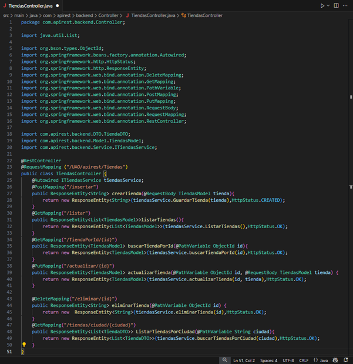

**Figura 39. Actualizar TiendasController**

## Paso 9: Actualizar la configuración de la conexión del proyecto con la base de datos

En este paso, se establecerá la conexión del proyecto con la base de datos en MongoDB Atlas. Para ello, será necesario abrir MongoDB Compass, conectarse al clúster en MongoDB Atlas y crear la base de datos *“Modulo3Ejemplo1”* utilizando el script definido en los pasos anteriores. Luego, se deberá configurar el archivo **`application.properties`** con la información del clúster, incluyendo el string de conexión, las credenciales de acceso, y el nombre de la base de datos. Un ejemplo de esta configuración se muestra en la _Figura 40._

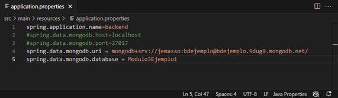

**Figura 40. Actualizar la conexión de la base de datos**

## Paso 10: Nuevas pruebas funcionales al backend

En este paso, se realizarán nuevas pruebas funcionales y de integración a la base de datos *“Modulo3Ejemplo1”* ubicada en el clúster creado en MongoDB Atlas. A continuación, se describen los casos de prueba:

### Caso 1: Crear un nuevo documento.

Se validará la integración mediante la creación de un nuevo documento en la colección *“Tiendas”*.

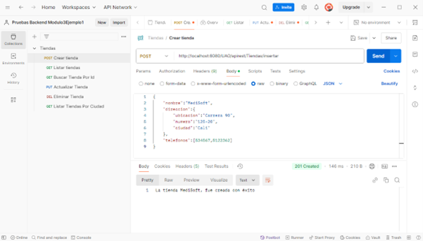

**Figura 41. Crear una nueva tienda para validar la conexión**

### Caso 2: Listar todos los documentos

Se probará la funcionalidad para listar todos los documentos creados en la colección *“Tiendas”*.

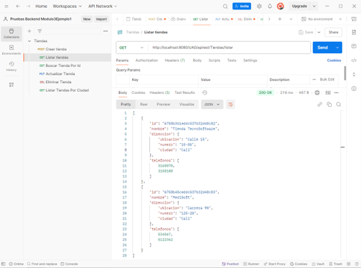

**Figura 42. Listar Tiendas**

### Caso 3: Buscar una tienda por Id

**Caso 3a (Éxito):** El id proporcionado existe en la base de datos.

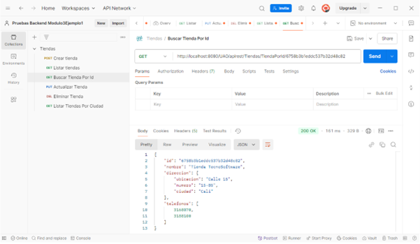

**Figura 43. Buscar Tienda por Id – Caso de Éxito**

**Caso 3b (Error 1):** El id proporcionado no existe en la base de datos. Se deberá generar el mensaje de error definido en el método _“buscarTiendaPorId”_, utilizando la excepción personalizada _“RecursoNoEncontradoException”_.

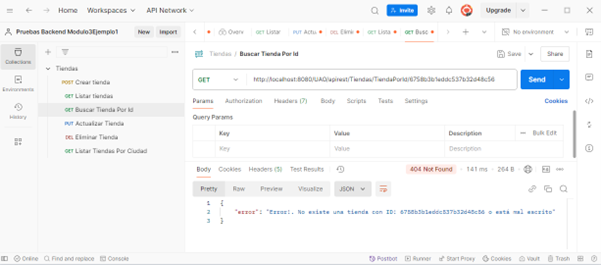

**Figura 44. Buscar Tienda por Id – Caso de Erróneo 1**

**Caso 3c (Error 2):** No se proporciona un id para realizar la búsqueda. Se deberá mostrar el mensaje configurado en el manejador global de excepciones _“GlobalExceptionHandler”_.

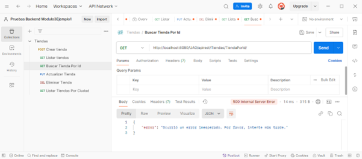

**Figura 45. Buscar Tienda por Id – Caso de Erróneo 2**

### Caso 4: Actualizar una tienda por Id

**Caso 4a (Éxito):** Se actualiza el nombre de una tienda y se agrega un nuevo teléfono.

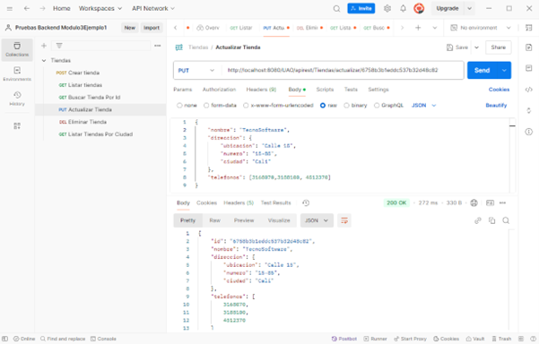

**Figura 46. Actualizar Tienda por Id – Caso de Éxito**

**Caso 4b (Error 1):** El id proporcionado no existe en la base de datos. Se deberá mostrar el mensaje de error definido en el método *“buscarTiendaPorId”*.

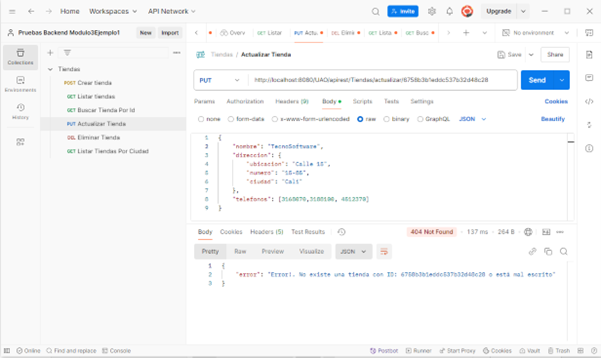

**Figura 47. Actualizar Tienda por Id – Caso de Erróneo 1**

**Caso 4c (Error 2):** No se proporciona un id para realizar la actualización. El error será manejado por el *“GlobalExceptionHandler”*.

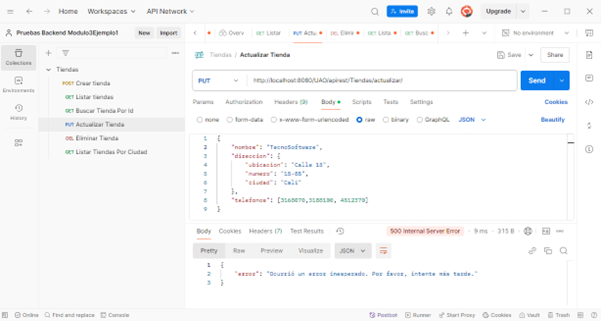

**Figura 48. Actualizar Tienda por Id – Caso de Erróneo 2**

### Caso 5: Eliminar una tienda por Id

**Caso 5a (Éxito):** El id proporcionado existe y la tienda es eliminada correctamente.

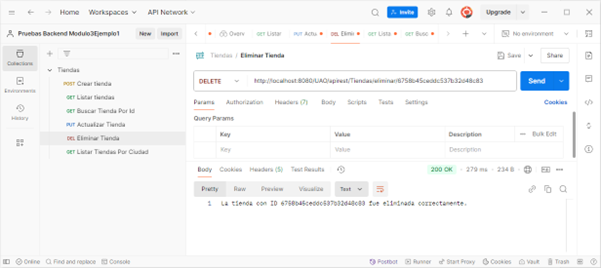

**Figura 49. Eliminar Tienda por Id – Caso de Éxito**

**Caso 5b (Error 1):** El id proporcionado no existe en la base de datos. Se deberá generar el mensaje de error definido en el método *“buscarTiendaPorId”*.

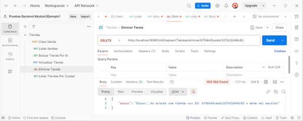

**Figura 50. Eliminar Tienda por Id – Caso de Erróneo 1**

**Caso 5c (Error 2):** No se proporciona un id para realizar la eliminación. El error será manejado por el *“GlobalExceptionHandler”*.

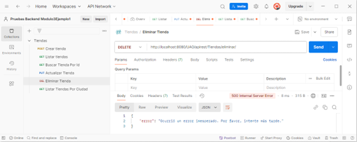

**Figura 51. Eliminar Tienda por Id – Caso de Erróneo 2**

### Caso 6: Consultar tiendas por ciudad

Se realizará una consulta personalizada para listar todas las tiendas ubicadas en una ciudad específica, por ejemplo, Cali.

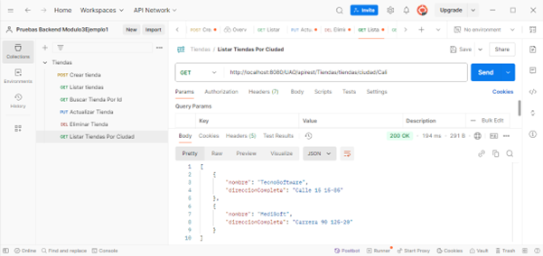

**Figura 52. Consulta Tiendas Por Ciudad**

## :blush: Ahora ya estás listo para desarrollar la [Actividad Asincrónica](14.3-Actividad-Asincronica.md) :muscle:
