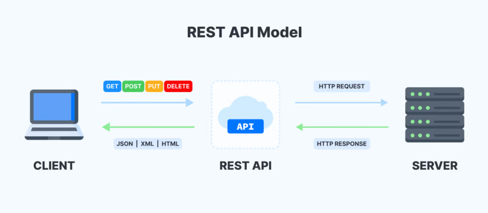
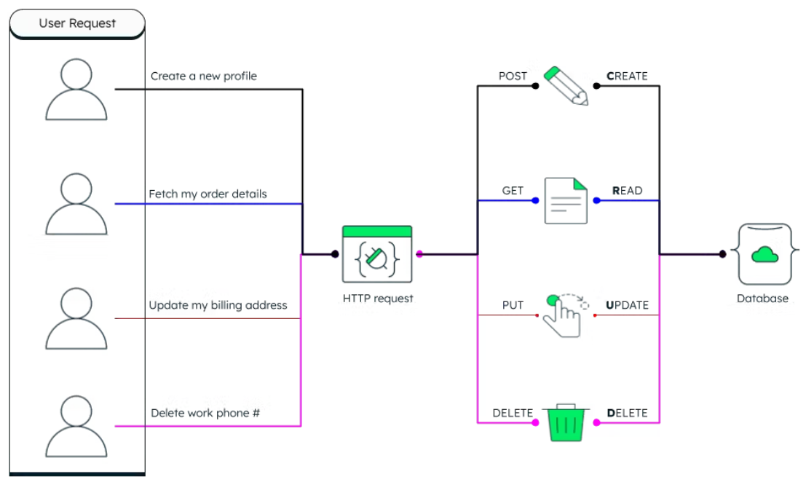

# Actividad Asincrónica

En el sitio del curso se encuentra disponible una nueva carpeta comprimida del proyecto, la cual incluye solo el mapeo de las colecciones “Sedes” y “Empleados”. Como parte de la actividad, deberá completarse el proyecto siguiendo lo desarrollado en esta guía e implementar las operaciones CRUD faltantes. Además, se recomienda practicar la realización de consultas personalizadas para fortalecer y profundizar el aprendizaje en la creación de un backend de una API REST.

 

