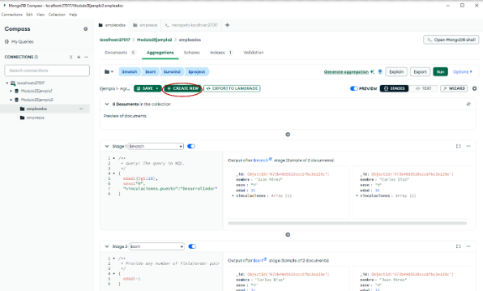
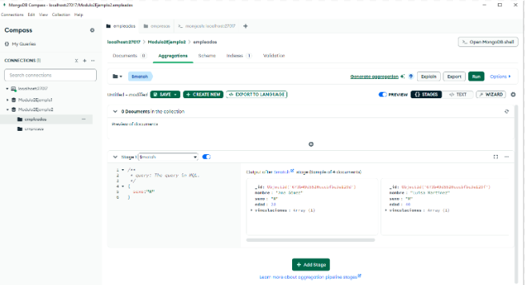
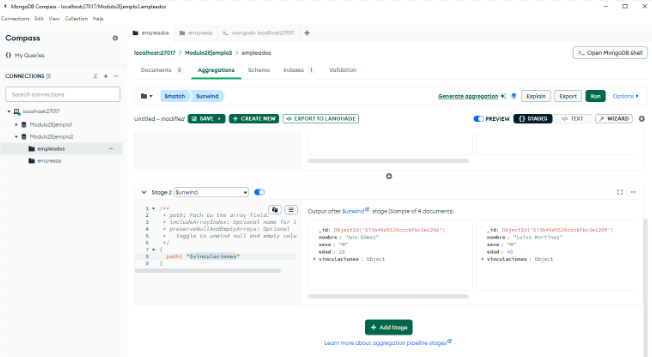
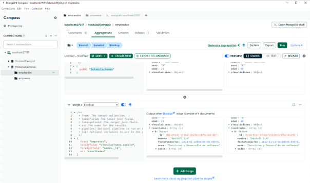
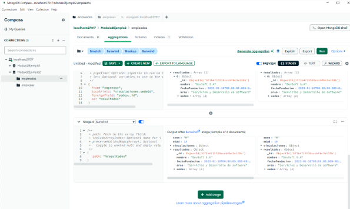
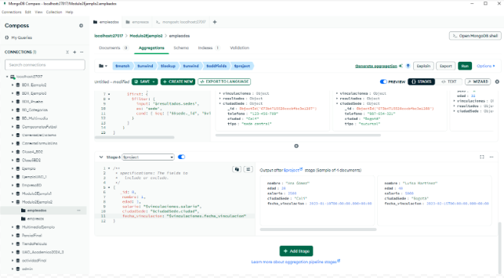
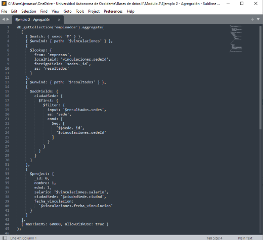

# Ejemplo práctico 1 

Se requiere obtener cuáles son los empleados de sexo femenino. Es necesario visualizar los campos nombre, edad, salario, ciudad de la sede donde está trabajando y fecha de vinculación. 

Si se tiene un pipeline de una agregación abierta, se deberá dar clic en el botón “**+ CREATE NEW**” para crear uno nuevo.  

 _**Figura 30: Crear un Nuevo Pipeline de Agregación**_ 

## _**Etapa 1: Filtrado con $match**_ 

Para iniciar, usar el operador $match para seleccionar solo los documentos que cumplan con los criterios especificados: 

- Sexo femenino “M”. 

 _**Figura 31: Etapa 1 – Ejemplo Práctico 1**_ 

## _**Etapa 2: Descomposición de arreglos con $unwind**_ 

Ahora, se deberá descomponer el array vinculaciones en múltiples documentos con el fin de generar un objeto (documento) separado por cada elemento del array. 

 _**Figura 32: Etapa 2 – Ejemplo Práctico 1**_ 

## _**Etapa 3: Crear la unión entre colecciones con $lookup**_ 

Unir los documentos de la colección empleados con la colección empresas basada en la relación entre: 

- vinculaciones.sedeId (de empleados) 

- sedes._id (de empresas). 

Al realiza esta etapa, se obtendrá como resultado un arreglo llamado resultados, el cual albergará los documentos coincidentes con la colección empresas. 

Explicación de los componentes del operador $lookup: 

a. `localField`: Campo del documento de entrada que se utilizará para la unión.  
b. `from`: Colección con la que se realizará la unión.  
c. `foreignField`: Campo de la colección unida que se utilizará para la unión.  
d. `as`: Este campo representa el nombre del arreglo de salida que contendrá los documentos coincidentes de la colección unida.
 
 

 _**Figura 33: Etapa 3 – Ejemplo Práctico 1**_ 

## _**Etapa 4: Descomposición de arreglos con $unwind**_ 

Descomponer el arreglo resultados (creado por el $lookup) en múltiples objetos (documentos) separados respecto a cada elemento del array. Esto garantizará que los datos de las empresas estén disponibles como un objeto individual (en lugar de un arreglo) para trabajar con sus valores. 

 

 _**Figura 34: Etapa 4 – Ejemplo Práctico 1**_ 

 ## _**Etapa 5: Agregar nuevos campos con $addFields**_ 

Agregar un campo temporal a los documentos involucrados en el pipeline. A este campo se lo nombrará “**ciudadSede**”, el cual contendrá los datos de la sede a la cual pertenece un empleado. Por tanto, este operador usa el operador **$filter** para buscar al interior del arreglo resultados.sedes la sede cuyo _id coincida con el sedeId de la vinculación actual del empleado. 

 

 _**Figura 35: Etapa 5 - Ejemplo Práctico 1**_ 

 ## _**Etapa 6: Proyección con $project**_ 

 

Script final de la agregación: 

 

 _**Figura 37: Script de la Agregación - Ejemplo Práctico 1**_ 
